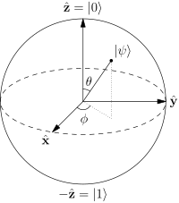
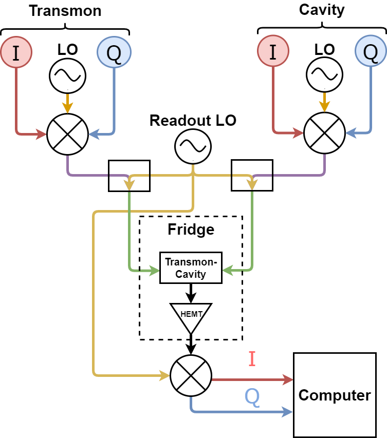
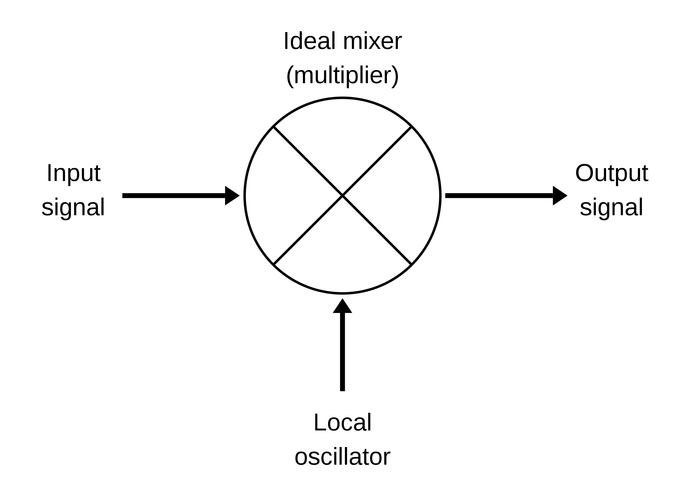
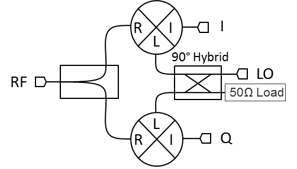
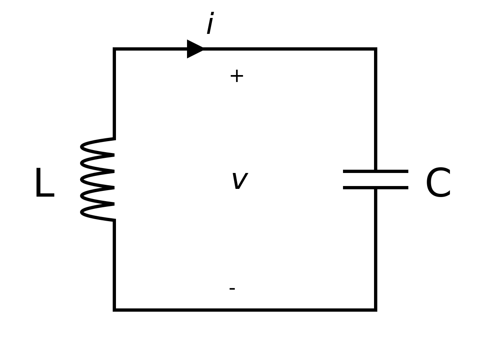

**Controlling a Superconducting Quantum Computer**

**Daniel Cohen Hillel**\
**Supervisor: Dr. Serge Rosenblum**

Advanced Project in Physics A (20382)\
The Open University of Israel\
The Weizmann Institute

Introduction
============

What is a Quantum Computer?
---------------------------

A classical computer is, essentially, a calculator, not of real numbers
but of *binary numbers*. A *binary digit* (\"*bit*\" from now on) can be
in one of two states, usually represented by 0 and 1. We can use *logic
gates* to control and manipulate bits to do various calculations. These
are the building blocks of the classical computer. With the ability to
do calculations on bits, and the ability to store bits in the memory we
can construct a computer.

So what is a quantum computer then? Well, if the classical computer uses
bits to do calculations, a quantum computer uses *quantum bits*
(\"*qubits*\" from now on) for calculations. A qubit, much the same as a
bit, has two states, a 0 state and a 1 state (denoted by $\lvert 0 \rangle$ and
$\lvert 1 \rangle$ for reasons we'll see later). The principal difference between
bits and qubits is that a qubit can be in a *superposition* of the two
states. We can use this property to our advantage by manipulating the
state of a quantum computer so that desired outcomes interfere
constructively, whereas undesired outcomes interfere destructively.

Algorithms and Further motivation
---------------------------------

`“Nature isn’t classical, dammit, and if you want to make a simulation of nature,you’d better make it quantum mechanical, and by golly it’s a wonderful problem,because it doesn’t look so easy.”`
\- Richard Feynman

The possibilities that quantum computation allow are unprecedented. From
simulation of drugs for developments of new cures to unbreakable
encryption, quantum computing promises a lot.

One of the most famous algorithms in quantum computing is *Shor's
algorithm*, a quantum algorithm for factoring large numbers. In
classical computing the way to factor a number is to verify if small
numbers divide it, one by one. Modern encryption method require you to
factor a large number[^2]. With classical computers this is a nearly
impossible problem, since solving this problem requires a time that
scales exponentially with the number of bits. This means that if we
increase the size of the number that we need to factor by just just one
bit, the time required to factorize the number increases by a factor of
two! Shor's algorithm, on the other hand, uses the power of quantum
computing to solve this problem in polynomial time![^3]. This means that
increasing the size of a number to be factorized could quickly become an
impossible task for a classical computer, it won't affect a quantum
computer as much.

While Shor's algorithm is a great example of the power of quantum
computers, and it is also probably the most famous quantum algorithm, it
is by no means the most interesting example. Decrypting messages and
breaking the world's cryptography isn't really a good motivator to try
to create quantum computers. Let's look at a more useful, optimistic
algorithm, *Grover's Algorithm*.

Grover's algorithm is a quantum algorithm that finds the unique input to
a black box function that produces a particular output value, using just
$o(\sqrt {N})$ evaluations of the function, where $N$ is the size of the
function's domain. For a classical algorithm to do this it would take
$o(N)$ evaluations. Therefore, Grover's algorithm provides us with a
quadratic speedup. Roughly speaking, given function $y = f(x)$ Grover's
algorithm finds $x$ when given a specific $y$. This algorithm could be
used to search in databases quadratically faster then with a classical
computer.

There are more quantum algorithms that were developed in the last
several decades, and even more algorithms that have yet to be developed
that might have impactful applications in the future.

Qubits and Quantum Gates
------------------------

Physically, a qubit is a two level quantum system. We call the first
level $\lvert 0 \rangle$ and the second level $\lvert 1 \rangle$. As we know from quantum
mechanics, the qubit could be in a superposition of the two states.

Mathematically, we think of qubits as 2-dimensional vectors, where the
first term corresponds to the $\lvert 0 \rangle$ state and the second term
corresponds to the $\lvert 1 \rangle$ state, so a qubit in a state
$\frac{1}{\sqrt{2}} \lvert 0 \rangle + \frac{1}{\sqrt{2}} \lvert 1 \rangle$ can be
represented as 

$$
\begin{pmatrix}
    \frac{1}{\sqrt{2}} \\
    \frac{1}{\sqrt{2}} 
\end{pmatrix} = \frac{1}{\sqrt{2}} \lvert 0 \rangle + \frac{1}{\sqrt{2}} \lvert 1 \rangle
$$

The complex pre-factors of each state are called probability amplitudes,
since they are related to the probability of the qubit to be in that
state. The probability is given by the absolute value of that state
squared 

$$
P(\lvert i \rangle) = \lvert \langle i \lvert \psi \rangle \lvert^2
$$

In the example I just
gave, the qubit has a $50\%$ chance to be in the $\lvert 0 \rangle$ state and a
$50\%$ chance to be in the $\lvert 1 \rangle$ state.

In this world of qubits as vectors, we think of logic gates (*quantum
gates*), as unitary matrices. When the qubit goes through a logic gate,
the resulting state is obtained by multiplying the initial state by the
matrix. Let's look at an example for one of the simplest logic gates we
have in classical computing, the NOT gate. A quantum implementation of
the NOT gate takes $\lvert 0 \rangle$ to $\lvert 1 \rangle$ and $\lvert 1 \rangle$ to $\lvert 0 \rangle$).
The matrix that achieves this is

$$
\begin{pmatrix}
    0 & 1 \\
    1 & 0
\end{pmatrix}
$$

Known as $\hat{\sigma}_x$ (Pauli matrix $X$). As a simple example to see how this works, if we input $\lvert 0 \rangle$ into the NOT
quantum gate, we get as a result 

$$
NOT \lvert 0 \rangle = 
\begin{pmatrix}
    0 & 1 \\
    1 & 0
\end{pmatrix}
\begin{pmatrix}
    1 \\
    0
\end{pmatrix} = 
\begin{pmatrix}
    0 \\
    1
\end{pmatrix} = \lvert 1 \rangle
$$

As we expected, NOT $\lvert 0 \rangle$ is $\lvert 1 \rangle$.
There are infinite 1-qubit quantum gates, while there are only four
possible one bit gates on a classical computer[^4].

The last thing we need to know to understand the basic of quantum
computing, is how to represent multiple qubits. If we have several of
qubits in our system, we think of all the qubits together as one vector
that is the *tensor product*[^5] of all the qubits. Let's say we have a
$\lvert 0 \rangle$ and $\lvert 1 \rangle$ qubits in our system, we represent that by
$\lvert 01 \rangle$ and it is equal to 

$$
\lvert 01 \rangle = \lvert 0 \rangle \otimes \lvert 1 \rangle =
\begin{pmatrix}
    0 \\
    1 \\
    0 \\
    0
\end{pmatrix}
$$

The tensor product of N qubits has $2^N$ coefficients! This is yet
another clue of the power that quantum computers have compared to
classical computers. A quantum gate on multiple qubits is thus a $2^N$
by $2^N$ square matrix.

Now that we have the basic tools of quantum computing, we can use them
to get motivation for the amazing things quantum computers can do

Superconducting Quantum Computers
---------------------------------

The physical implementation of the qubit itself isn't the subject of
this project but we still take a look for a bit on how would you
implement such a thing. A problem we have to face when making a quantum
computer is what physical phenomenon would be the qubit. We need some
sort of two level system that we can easily measure and manipulate,
while also staying coherent[^6] and usable. For classical computers we
already have this figured out for years, a bit is a voltage on a wire, 1
is one there is voltage on the wire and 0 if there's none, simple. For a
quantum computer this is much more complicated, there are many quantum
phenomena we can use as our qubit, such as the energy level of an atom,
the spin of an electron, the polarization of photons and so on. It is
not so obvious what should be the physical realisation of the qubit.
This project is about a *superconducting* quantum computer, with
superconducting qubits.

Superconducting qubits are microwave circuits in which the cooper-pair
condensate effectively behaves as a one-dimensional quantized particle.
By inserting Josephson junctions, the circuit can be made nonlinear,
allowing us to isolate the qubit from higher-energy levels and treat it
as a two level system (instead of the many level system that it really
is).

This topic is covered in appendix [8](#appen:LC), refer there for any additional information,
preferably read the appendix after reading chapter
[2](#chap:quantum-optics).

References and Further Readings
-------------------------------

The main references for this chapter were two great books on quantum
information I recommend everyone to read. The first is the well known,
*de-facto* book on quantum computation and information. \"**Quantum
Computation and Quantum Information**\" written by Michael Nielsen and
Isaac Chuang also known as \"Mike and Ike\". This book covers
everything.

The other book I used was \"**Quantum Computing for Computer
Scientists**\" by Mirco A. Mannucci and Noson S. Yanofsky. It has, in my
opinion, clearer explanations on the pure mathematical nature of quantum
information, although it is not as comprehensive as \"Mike and Ike\".

Quantum Optics {#chap:quantum-optics}
==============

This chapter introduces concepts in *Quantum Optics*. The implementation
of quantum computers we discuss in this manuscript has a qubit which is
a two level system[^7] interacting with light (both classical and
quantum) inside a resonating cavity.

Dirac's Method for Canonical Quantization
-----------------------------------------

Before we dive into anything new, we'll start by going over the method
to quantize any oscillating phenomena introduced by Paul Dirac in his
1925 Ph.D. dissertation.

Any system of which we have a classical description can be quantized
following a process known as canonical quantization. A classical system
can be described by pairs of *canonically conjugate variables*,
$(q_j, p_j)$ satisfying the Hamilton equations

$$
\begin{aligned}
    &\dot{q}_j =\quad \frac{\partial H}{\partial p_j} \\
    &\dot{p}_j = -\frac{\partial H}{\partial q_j}
\end{aligned}

$$

$q_j$ is called the *canonical coordinate* and $p_j$ is called the
*canonically conjugate momentum to the coordinate $q_j$*.

To quantize the system we need to replace the dynamical variables
$(q_j, p_j)$ with canonically conjugate operators
$(\hat{q_j}, \hat{p_j})$ satisfying the commutation relation

$$
[\hat{q}_j, \hat{q}_k] = [\hat{p}_j, \hat{p}_k] = 0 \quad  \text{and} \quad [\hat{q}_j, \hat{p}_k] = i\hbar \delta_{jk}
$$

The Hamiltonian of the quantum system is obtained by replacing the
classical Hamiltonian $E = H (q_1,p_1, \dots ,q_j, p_j, \dots)$ with the
quantum Hamiltonian
$\hat{H} = H (\hat{q_1},\hat{p_1}, \dots ,\hat{q_j}, \hat{p_j}, \dots)$.

Dirac's method is best used to solve the system of the quantum harmonic
oscillator. The Hamiltonian of the system is

$$
\hat{H} = \frac{\hat{p}^2}{2m} + \frac{1}{2}m\omega^2 \hat{q}^2
$$
 To
solve it you introduce the annihilation and creation operators (Also
called the \"ladder operators\"), $\hat{a}$ and $\hat{a}^\dag$
respectively. The ladder operators satisfy the commutation relation
$[\hat{a}, \hat{a}^\dag] = 1$. Since $\hat{a} \ne \hat{a}^\dag$, these
operators are not hermitian and therefore not observables of the system,
but every observable of the system can be expressed using them. The
operators are 
$$
\begin{aligned}
    \hat{a} = \sqrt{\frac{m \omega}{2\hbar}} (\hat{q} + \frac{i}{m\omega}\hat{p}) \\
    \hat{a}^\dag = \sqrt{\frac{m \omega}{2\hbar}} (\hat{q} - \frac{i}{m\omega}\hat{p})\end{aligned}
$$

The Hamiltonian is therefore

$$
\hat{H} = \hbar \omega (\hat{a}^\dag\hat{a} + \frac{1}{2})
$$
 The
energy eigenstates are denoted $\lvert 0 \rangle, \lvert 1 \rangle, \lvert 2 \rangle, \dots$ where
$\lvert n \rangle$ is the eigen state of the $n^{th}$ energy level, $E_n$. A set
of important relations between the eigenstates the the ladder operators
are 
$$
\begin{aligned}
    &\hat{a}^\dag \lvert n \rangle = \sqrt{n+1}\lvert n+1 \rangle \\
    &\hat{a} \lvert n \rangle = \sqrt{n}\lvert n-1 \rangle \\
    &\hat{a} \lvert 0 \rangle = 0\end{aligned}
$$
 From these relations the ladder
operators get their name, since you can think of them as ways to climb
up and down the energy \"ladder\". These eigenstates are called the
**number states** or **Fock states** after Vladimir Fock who developed
this representation. The number states $\lvert n \rangle$ are also the
eigenstates of the *number operator* $\hat{N} = \hat{a}^\dag\hat{a}$,
with eigenvalue $n$, $\hat{N}\lvert n \rangle =  n\lvert n \rangle$, hence the name.

The Quantization of the Electromagnetic Field
---------------------------------------------

### The Homogeneous Electromagnetic Equation

Maxwell's equations in free space are

[\[eq:optim\]]{#eq:optim label="eq:optim"} 
$$
\begin{aligned}
        &\nabla \cdot \textbf{E} = 0 \\ % \label{eq:Maxwell-1} 
        &\nabla \cdot \textbf{B} = 0 \\ % \label{eq:Maxwell-2}\\
        &\nabla \times \textbf{E} = \frac{\partial\textbf{B}}{\partial t} \\ % \label{eq:Maxwell-3}\\
        &\nabla \times \textbf{B} = \mu_0 \epsilon_0 \frac{\partial\textbf{E}}{\partial t} % \label{eq:Maxwell-4}
    \end{aligned}
$$

Taking the curl of
[\[eq:Maxwell-3\]](#eq:Maxwell-3) and
[\[eq:Maxwell-4\]](#eq:Maxwell-4) yields

[\[eq:curl-\]]{#eq:curl- label="eq:curl-"} 
$$
\begin{aligned}
        &\nabla \times{ (\nabla \times{\textbf{E}})} 
        = \nabla \times{ (-\frac{\partial \textbf{B}}{\partial t})} 
        = -\frac{\partial}{\partial t} (\nabla \times{\textbf{B}})
        = - \mu_0 \epsilon_0 \frac{\partial^2 E}{\partial t^2} \\
        % \label{eq:curl-E}\\
        &\nabla \times{ (\nabla \times{\textbf{B}})} 
        = \nabla \times{ (\mu_0 \epsilon_0 \frac{\partial E}{\partial t})} 
        = \mu_0 \epsilon_0\frac{\partial}{\partial t} (\nabla \times{E}) 
        = - \mu_0 \epsilon_0 \frac{\partial^2 \textbf{B}}{\partial t^2} 
        % \label{eq:curl-B}
    \end{aligned}
$$

Using the vector identity

$$
\nabla \times \left ( \nabla \times \mathbf{V} \right) = \nabla \left ( \nabla \cdot \mathbf{V} \right) - \nabla^2 \mathbf{V}
$$

We obtain from [\[eq:curl-E\]](#eq:curl-E) and
[\[eq:curl-B\]](#eq:curl-B)

$$
\begin{aligned}
        &\nabla (\nabla \cdot \textbf{E}) - \nabla^2 \textbf{E} 
        = -\mu_0\epsilon_0\frac{\partial^2 \textbf{E}}{\partial t^2} \\
        &\nabla (\nabla \cdot \textbf{B}) - \nabla^2 \textbf{B} 
        = -\mu_0\epsilon_0\frac{\partial^2 \textbf{B}}{\partial t^2}
    \end{aligned}
$$

Using [\[eq:Maxwell-1\]](#eq:Maxwell-1) and
[\[eq:Maxwell-2\]](#eq:Maxwell-2) to cancel the left most term we get

$$
\begin{aligned}
        &\nabla^2 \textbf{E} = \mu_0\epsilon_0\frac{\partial^2 \textbf{E}}{\partial t^2}\\
        &\nabla^2 \textbf{B} = \mu_0\epsilon_0\frac{\partial^2 \textbf{B}}{\partial t^2}
\end{aligned}
$$

Replacing $v_{ph} = \frac{1}{\sqrt{\mu_0\epsilon_0}}$ with $c$ since the
phase velocity is the speed of light for electromagnetic radiation in
vacuum 
$$
% \label{eq:Homo_electro_wave}
    \begin{aligned}
        \nabla^2 \textbf{E} = \frac{1}{c^2}\frac{\partial^2 \textbf{E}}{\partial t^2} \\
        \nabla^2 \textbf{B} = \frac{1}{c^2}\frac{\partial^2 \textbf{B}}{\partial t^2}
    \end{aligned}
$$

These equation are called *the homogeneous electromagnetic wave
equations*. We'll pick a polarization, arbitrarily, to be in the x
direction. The equations become 

$$
% % \label{eq:Homo_electro_wave_pol}
\begin{aligned}
    \frac{\partial^2 E_x}{\partial x^2} = \frac{1}{c_0^2}\frac{\partial^2 E_x}{\partial t^2} \\
    \frac{\partial^2 B_y}{\partial y^2} = \frac{1}{c_0^2}\frac{\partial^2 B_y}{\partial t^2} 
\end{aligned}
$$

### The Single Mode Cavity

Now that we have the homogeneous electromagnetic field equations at hand
we can solve them. We solve
[\[eq:Homo\_electro\_wave\_pol\]](#eq:Homo_electro_wave_pol) using separation of variables,

$$
E_x (z, t)= Z (z)T (t)
$$
 Yielding the solution,[^8] 
$$
\begin{aligned}
        E_x (z, t) = \sqrt{\frac{2 \omega_c^2}{V \epsilon_0}}q (t)\sin{kz} \\
        B_y (z, t) = \sqrt{\frac{2 \mu_0}{V}}\dot{q} (t)\cos{kz}
    \end{aligned}
$$
 where $V$ is the effective volume of the cavity, $q$
is a time-dependent amplitude with units of length, $k = m\pi/L$ for an
integer $m > 0$, and $\omega_c$ is the frequency of the mode.

The Hamiltonian of a single mode is hence given by 
$$
\begin{aligned}
    H &= \frac{1}{2}\int\epsilon_0 \textbf{E}^2 + \frac{\textbf{B}^2}{\mu_0} dV \\
    &= \frac{1}{2}\int\epsilon_0 E_x^2 (z, t) + \frac{B_y^2 (z, t)}{\mu_0} dz \\
    &= \frac{1}{2}[\dot{q}^2 (t) + \omega_c^2 q^2 (t)]\end{aligned}
$$

Going from dynamical variables to operators, $\hat{q}$ and $\hat{p}$
that satisfy the commutation relation $[\hat{q}, \hat{p}] = i\hbar$, we
get 
$$
\begin{aligned}
     &\hat{E}_x (z, t) = \sqrt{\frac{2 \omega_c^2}{V \epsilon_0}}\hat{q} (t)\sin{kz} \\
     &\hat{B}_y (z, t) = \sqrt{\frac{2 \mu_0}{V}}\hat{p} (t)\cos{kz} \\
     &\hat{H} = \frac{1}{2}[\hat{p}^2 (t) + \omega_c^2 \hat{q}^2 (t)]\end{aligned}
$$

This is the same Hamiltonian as for the harmonic oscillator.
**Electromagnetic radiation acts as a harmonic oscillator**.

Let's introduce creation and annihilation operators 
$$
\begin{aligned}
    \hat{a} (t) = \frac{1}{\sqrt{2\hbar\omega_c}}[\omega_c\hat{q} (t) + i\hat{p} (t)] \\
    \hat{a}^\dag (t) = \frac{1}{\sqrt{2\hbar\omega_c}}[\omega_c\hat{q} (t) - i\hat{p} (t)]\end{aligned}
$$

In term of the creation and annihilation operators, the electric and
magnetic field operators become 
$$
\begin{aligned}
         &\hat{E}_x (   z, t) = E_0[\hat{a} (t) + \hat{a}^\dag (t)]\sin{kz} \\
         &\hat{B}_y (z, t) = \frac{E_0}{c}[\hat{a} (t) - \hat{a}^\dag (t)]\cos{kz}\end{aligned}
$$

And we can write the Hamiltonian as 
$$
% \label{eq:cavity_hamiltonian}
    \hat{H}_{cavity} = \hbar\omega_c[\hat{a}\hat{a}^\dag + \frac{1}{2}] \approx \hbar\omega_c\hat{a}\hat{a}^\dag
$$

Ignoring the zero-point energy $\frac{\hbar\omega_c}{2}$.

Since the eigenstates of the quantum harmonic oscillator are the number
states $\lvert n \rangle$, they are also the eigenstates of electromagnetic
radiation. We can show that the momentum operator of electromagnetic
radiation takes the form
$\hat{P} = \hbar \textbf{k} \hat{a}^\dag \hat{a}$. Where $\textbf{k}$ is
the wave number of the electromagnetic wave. Applying the momentum
operator to the number states we see that

$$
\hat{P}\lvert n \rangle =  \hbar \textbf{k} \hat{a}^\dag \hat{a} \lvert n \rangle = n\hbar \textbf{k}\lvert n \rangle
$$

This is an important result, **the $\lvert n \rangle$ state has well defined
energy and momentum, same as $n$ particles, each with energy
$\hbar \omega$ and momentum $\hbar \textbf{k}$, we call these particles
*photons*.** Hopefully you now see why these are called number states,
they correspond to the *number of photons in the cavity*.

The Jaynes--Cummings Model
--------------------------

Our goal is to mathematically model the Hamiltonian of a system of a
two-level system, such as an atom, interacting with a single quantized
mode of an electromagnetic field inside an optical cavity. First we'll
divide the system into 3 parts, The atom, the cavity, and the
interaction between them.

### The Hamiltonians {#sec:the-hamiltonians}

We separate the Hamiltonian as

$$
H = H_{atom} + H_{cavity} + H_{interaction}
$$
 We'll now calculate each
Hamiltonian separately

#### cavity {#cavity .unnumbered}

We already calculated the Hamiltonian of the cavity and it is given by
equation
[\[eq:cavity\_hamiltonian\]](#eq:cavity_hamiltonian) as

$$
\boxed{\hat{H}_{cavity} = \hbar\omega_c\hat{a}\hat{a}^\dag}
$$

#### atom {#atom .unnumbered}

The atom is a two-level system, meaning its state is in a general
superposition of the ground, $\lvert g \rangle$, and excited, $\lvert e \rangle$, states.
We know that $\hat{H}\lvert \psi \rangle = E_\psi \lvert \psi \rangle$ for every energy
eigenstate, with energy $E_\psi$. We can use these eigenstates to
spectrally decompose the Hamiltonian,
$\hat{H} = \sum_\psi E_\psi \lvert \psi \rangle\langle \psi \lvert$. In our case, with
only ground and excited states, the Hamiltonian is

$$
\hat{H}_{atom} = E_g\lvert g \rangle\langle g \lvert + E_e\lvert e \rangle\langle e \lvert
$$
 Using the
vector representation of these states we'll write 
$$
\begin{aligned}
    \hat{H}_{atom} &= 
    E_e \begin{bmatrix}
    1 & 0     \\
    0   & 0   \\
    \end{bmatrix}
    + E_g \begin{bmatrix}
    0 & 0     \\
    0   & 1   \\
    \end{bmatrix} = 
    \begin{bmatrix}
    E_e & 0     \\
    0   & E_g   \\
    \end{bmatrix} \\
    % &= \frac{1}{2}\begin{bmatrix}
    % E_g + E_e & 0          \\
    % 0         & E_g + E_e  \\
    % \end{bmatrix} +
    % \frac{1}{2}\begin{bmatrix}
    % E_e - E_g & 0          \\
    % 0         & - (E_e - E_g)  \\
    % \end{bmatrix} \\
    % &= \frac{1}{2} (E_g + E_e)\begin{bmatrix}
    % 1 & 0          \\
    % 0         & 1  \\
    % \end{bmatrix} +
    % \frac{1}{2} (E_e - E_g)\begin{bmatrix}
    % 1 & 0          \\
    % 0         & -1  \\
    % \end{bmatrix} \\
    &= \frac{1}{2} (E_g + E_e)\mathbb{I} + \frac{1}{2} (E_e - E_g)\hat{\sigma}_z\end{aligned}
$$

Again, we define the zero point energy so that the first term becomes
$0$. The energy difference is associated with a frequency $\omega_a$ and
from the de-broglie relations $E = \hbar\omega$ so
$E_e - E_g = \hbar\omega_a$. The atom Hamiltonian is therefore

$$
\boxed{\hat{H}_{atom} = \frac{1}{2}\hbar\omega_a\hat{\sigma}_z}
$$

#### interaction {#interaction .unnumbered}

The atom-cavity coupling comes from the interaction between the atomic
dipole, $\hat{\textbf{d}}$, and the electric field of the cavity mode,
$\hat{\textbf{E}}$. The corresponding Hamiltonian is

$$
\hat{H}_{interaction} = -\hat{\textbf{d}}\cdot\hat{\textbf{E}} = -\hat{d} E_0 \sin{kz} (\hat{a} + \hat{a}^\dag{})
$$

Where we assumed that the atomic dipole and electric field are
parallel[^9]. We'll introduce the atomic transition operators

$$
\hat{\sigma}_+ = \lvert e \rangle\langle g \lvert, \quad\quad \hat{\sigma}_- = \lvert g \rangle\langle e \lvert = \hat{\sigma}_+^{\dag{}}
$$

Due to parity selection rules, only the off-diagonal, only the
off-diagonal elements of the dipole operator are nonzero so we may write

$$
\hat{d} = d\lvert e \rangle\langle g \lvert + d^* \lvert g \rangle\langle e \lvert = d\hat{\sigma}_- + d^* \hat{\sigma}_+ = d (\hat{\sigma}_+ + \hat{\sigma}_-)
$$

Thus, the interaction Hamiltonian is

$$
\hat{H}_{interaction} = \hbar\Omega (\hat{\sigma}_+ + \hat{\sigma}_-) (\hat{a} +  \hat{a}^\dag) 
    = \hbar\Omega (\hat{\sigma}_+\hat{a} + \hat{\sigma}_+\hat{a}^\dag + \hat{\sigma}_-\hat{a} + \hat{\sigma}_-\hat{a}^\dag)
$$

2 [eq:interaction-hamiltonian](#eq:interaction-hamiltonian) Where $\Omega = -\frac{d}{\hbar}\sqrt{\frac{\hbar \omega_c}{\epsilon_0 V}} \sin (kz)$
is the amplitude of the interaction. From
[\[eq:cavity\_hamiltonian\]](#eq:cavity_hamiltonian) the cavity ladder operators $\hat{a}$
and $\hat{a}^\dag$ evolve as

$$
\hat{a} (t) = \hat{a} (0)e^{-i\omega_c t}, \quad\quad \hat{a}^\dag{} (t) = \hat{a}^\dag{} (0)e^{i\omega_c t}
$$

And similarly we can show for the free evolution of the atom

$$
\hat{\sigma}_{\pm} (t) =   \hat{\sigma}_{\pm} (0)e^{\pm i\omega_a t}
$$

We can write while approximating $\omega_c \approx \omega_a$

$$
\begin{aligned}
        &\hat{\sigma}_+\hat{a} \sim e^{i (\omega_0 - \omega)t}\\
        &\hat{\sigma}_-\hat{a}^\dag \sim e^{-i (\omega_0 - \omega)t}\\
        &\hat{\sigma}_+\hat{a}^\dag \sim e^{i (\omega_0 + \omega)t}\\
        &\hat{\sigma}_-\hat{a} \sim e^{-i (\omega_0 + \omega)t}
    \end{aligned}
$$
 We can see that the last two term vary much more
rapidly than the first two. Furthermore, the last two terms do not
conserve energy (They correspond to *\[photon addition + atom
excitation\]* and *\[photon reduction + atom relaxation\]*). Therefore,
we can drop the quickly rotating terms[^10], yielding

$$
% \label{eq:interaction-hamiltonian-RWA}
    \boxed{H_{interaction} = \hbar\Omega (\hat{\sigma}_+\hat{a} + \hat{\sigma}_-\hat{a}^\dag)}
$$

Finally, we can write the full JC Hamiltonian

$$
% \label{eq:JC-hamiltonian}
    \boxed{\hat{H} = \frac{1}{2}\hbar \omega_0\hat{\sigma}_z 
                     + \hbar \omega \hat{a}^\dag \hat{a} 
                     +  \hbar\Omega (\hat{\sigma}_+\hat{a} + \hat{\sigma}_-\hat{a}^\dag)}
$$

### Interaction with a Classical Field {#sec:interaction-with_classical-field}

As you might have noticed, we are classical creatures, I'm (fortunately)
not in a superposition of being dead and alive at the same time. As
classical creatures, if we want to interact with the quantum world we
need to do so with classical means, with a classical interface to the
quantum world. Back to the Jaynes-Cummings model, what happens when we
introduce a classical electromagnetic field (such as the microwave
drives that control the superconducting system)?

We can do the full rigorous way to calculate the interactions between
the quantized atom and the classical electromagnetic field, but instead,
we can use a \"hack\"[^11] to make the calculations much simpler, since
we already calculated the interaction between the atom and the
*quantized* electromagnetic field. The Hamiltonian of the full quantum
interaction, as given in equation
[\[eq:interaction-hamiltonian\]](#eq:interaction-hamiltonian) is

$$
H_{interaction} = \hbar \Omega (\hat{\sigma}_+ + \hat{\sigma}_-) (\hat{a} + \hat{a}^\dag)
$$

We can go from the quantized field to the classical field by simply
replacing the field operators with dynamical variables representing the
strength of the field, $\hat{a} \rightarrow a$ and
$\hat{a}^\dag \rightarrow a^*$. We can also replace
$\hat{\sigma}_+ + \hat{\sigma}_-$ with the Pauli matrix $\hat{\sigma}_x$
and get 
$$
% \label{eq:atom-field-class-int}
    H_{classical} = \hbar \Omega a \cdot \hat{\sigma}_x
$$

The transition from the middle term to the right term is allowed since
we know that the Pauli matrices are observable quantities, hence are
hermitian conjugates of themselves. $a$ is the amplitude of the
classical field, later we'll replace it with $\epsilon_I (t)$ and
$\epsilon_Q (t)$ for the drive fields since the classical field is not
constant and it is, in fact, what we control in the system, but I'm
getting ahead of myself, more on this will be shown in the optimal
control chapter [3](#chap:optimal).

### Effective Hamiltonian in the Dispersive Limit {#sec:dispersive}

As we've in appendix [6](#appen:annalytic), when an atom interacts with a classical
electromagnetic field, it oscillates between higher and lower energy
states. These oscillations are the so called ***Rabi Oscillations*** and
are an important result in the atom-photon interaction theory. There is
one catch though, if the electromagnetic field doesn't have **exactly**
the same energy as the energy difference between the two levels of the
atom, the atom will never reach fully the higher energy state (see
figure [20](#fig:rabi-oscillations)). The difference between the energy
of the electromagnetic field, and the atom energy difference is called
the detuning,
$\Delta = \omega_{field} - \omega_{atom} = \frac{E_{field} - E_{atom}}{\hbar}$.
The dispersive limit occurs when the detuning is very large compared to
the frequencies (in terms of the variables used in appendix
[6](#appen:annalytic),
the limit is for $\Delta \gg \Omega_0$).

We are now going to consider the energies of the states $\lvert g, n \rangle$ and
$\lvert e, n+1 \rangle$, for any $n$. The energies are the eigenvalues of the
Hamiltonian[^12]. We can write this Hamiltonian as

$$
\hat{H}_n = \frac{\hbar}{2} (\Delta \hat{\sigma}_z + \Omega_n \hat{\sigma}_y) + \hbar \omega_0 (n + \frac{1}{2})\hat{I}
$$

Where $\Omega_n = \Omega_0 \sqrt{n + 1}$.

The eigenvalues of this operator are

$$
E_n^\pm = \hbar \omega_0 (n + \frac{1}{2}) \pm \frac{\hbar}{2}\sqrt{\Delta^2 +\Omega_n^2}
$$

Where the $\pm$ is $+$ for the ground state of the atom and $-$ for it's
excited state. For $\Delta \gg \Omega_n$ we can approximate the square
root as a Taylor series, and the overall expression is

$$
E_n^\pm = \hbar \omega_0 (n + \frac{1}{2}) \pm (\frac{\Delta}{2} + \frac{\Omega_n^2}{\Delta}) =  \hbar \omega_0 (n + \frac{1}{2}) \pm (\frac{\Delta}{2} + \frac{ (n+1)\Omega_0^2}{\Delta})
$$

We can replace the number $n$ with the operator
$\hat{n} = \hat{a}^\dag \hat{a}$. Moreover, the operator
$\hat{\sigma}_z$ can be used to \"replace\" the $\pm$, since it's
eigenvalue is $+1$ for the ground state and $-1$ for the excited state.
The overall Hamiltonian is of the form

$$
% \label{eq:dispersive-hamiltonian}
    \hat{H}_{\text{eff}} = \hbar \omega_0 \hat{a}^\dag \hat{a} + \frac{\Delta^2 + \Omega_0^2}{2\Delta}\hat{\sigma}_z + \frac{\Omega_0^2}{\Delta} \hat{a}^\dag \hat{a} \hat{\sigma}_z
$$

The physical interpretation of this new expression is that the frequency
of the cavity changes by $\chi = 2\frac{\Omega^2}{\Delta}$ depending on
the state of the atom. Or equivalently, the atom transition frequency
changes by $\chi$ for each additional photon in the cavity.

Visualizing Quantum States
--------------------------

As you'll soon find out in the optimal control chapter, we're going to
develop a system that is some sort of a *black box*. We can't really
control directly how it works, we can only make indirect changes to try
to get everything to work[^13].

This is why we want to get as much insight about the system as we can,
and understand that insight in a way that allows us to create
intelligent changes to the system according to the data we gather.
Visualization of quantum states give us a better understanding of the
system performance, and allows us to better diagnose errors. There are
many more ways to visualize quantum information than I show here,but the
methods I will present are sufficient for our purposes.

### Population Graphs

The simplest way we can visualize the quantum system is using
*population graphs*. In a population graph, you plot the probability
that the quantum system is in each of its possible eigenstates. For a
time-dependent unitary operator, $\hat{U} (t)$, acting on an initial
state $\lvert \psi \rangle$, the population of the eigenstates $\lvert \phi_n \rangle$
over time is given by

$$
P_n (t) = \lvert\langle \phi_n \lvert\hat{U} (t)\lvert \psi \rangle\lvert^2
$$
 Although they
are simple, population graphs are a really powerful, simple tool you can
use to visualize the system.

### The Bloch Sphere

As it turns out, you can represent any qubit in the form[^14]

$$
\lvert \psi \rangle = \cos{\frac{\theta}{2}}\lvert 0 \rangle + e^{i \phi} \sin{\frac{\theta}{2}}\lvert 1 \rangle
$$

This representation describes a sphere with polar coordinate $\theta$
and azimuthal coordinate $\phi$. Since this is the case, it's very
useful to visualize a qubit state as some point on a sphere, the *Bloch
Sphere*. An example of the representation of a state using the Bloch
sphere is shown in Figure [1](#fig:Bloch-Sphere)

{#fig:Bloch-Sphere
width="0.3\\columnwidth"}

### Wigner Function

The *Wigner function* is the *distribution* in the *phase space* of a
continuous variable quantum system[^15]. For classical systems, phase
space distributions correspond to a classical probability distribution.
However, the Wigner function the distribution also involves quantum
uncertainty. Wigner functions can take on negative values in small
regions, and are therefore quasi-probability distributions. This is
allowed, since only areas larger than $\hbar$ are ever allowed to be
measured, according to the Heisenberg uncertainty principle.

The Wigner function of a particle with wave function $\psi (q)$, is
defined as

$$
W (q, p) := \frac{1}{\pi \hbar} \int_{-\infty}^\infty \psi^* (q + y) \psi (q - y) e^{\frac{2ipy}{\hbar}} dy
$$

An interesting example to use of the Wigner function is looking at the
Wigner function of a Fock state. The Wigner distribution of a Fock state
could be calculated directly from definition and the resulting
expression is[^16]

$$
W_n = \frac{2}{\pi} (-1)^n L_n[4 (q^2 + p^2)]e^{-2 (q^2 + p^2)}
$$
 More
importantly, we can look at a heat map of the Wigner function, as a nice
visual aid to understand the state. An example of the $\lvert 4 \rangle$ state
Wigner distribution is shown in figure
[2](#fig:Fock-State-Wigner)

{#fig:Fock-State-Wigner width="0.3\\columnwidth"}

References and Further Readings
-------------------------------

The standard introductory book on this subject (which is also the one I
used for reference) is \"**Introductory Quantum Optics**\" by
Christopher C. Gerry and Peter L. Knight.

Another great resource is the series of online lectures taught by Prof.
Alain Aspect from École Polytechnique.

Optimal Control {#chap:optimal}
===============

In this chapter, we tackle the problem of *Quantum Optimal Control*. We
control our quantum system by sending some (classical)electromagnetic
pulse into a cavity. An obvious question arises: what pulse shape needs
to be sent to achieve a particular operation on our quantum system?

It turns out that this questions does not have an easy answer. In the
rest of the chapter we'll try to give an answer using an algorithm
called ***GRAPE***.

GRAPE
-----

Although in some cases we can calculate the desired pulse
analytically[^17], most of the time this isn't an option. Often, we need
to use numeric means to find an optimal pulse. To find the desired pulse
numerically, we can model our system on a classical computer and
simulate what happens when you send a pulse. Using the results of the
simulation, we try to change the pulse until we get the desired effect.

So what's GRAPE then? GRAPE in an acronym for ***GR**adient **A**scent
**P**ulse **E**ngineering*. When we model a quantum system, in our case,
a qubit interacting with a cavity, we can model the physical information
about the system using the Hamiltonian of the system. We can split the
Hamiltonian into two. There's the Hamiltonian that nature gives us, of
how a qubit behaves and how it interacts with its surrounding. And
there's the Hamiltonian we control, using electromagnetic control
pulses. We can send any possible pulse shape. To account for that fact,
we treat the pulse as a function of time, as a step-wise constant
function. The pulse is, essentially, just an array of many variables,
and we want to find the values that give the desired result. This is a
classical case of an optimization problem. To optimize the values, we
set a cost function that tells us how \"good\" the current pulse is.

In principle, we could use a brute-force search and check every possible
pulse until we find one that minimizes the cost function. This method is
inefficient. A better way to optimize the function is by calculating
also the *gradient* of the cost function, and using an optimization
algorithm[^18], to find the minimum of the function efficiently.

{#fig:step-wise-const
width="0.3\\columnwidth"}

The Cost Function
-----------------

When our desired operation is to prepare our quantum system in a
predetermined state, a good figure of merit of how close our system is
to the desired state is given by the **fidelity**. The fidelity is a
measure of the \"closeness\" of two quantum states, The fidelity is $0$
when the two states are orthogonal, and $1$ if they are identical. The
fidelity is given by the magnitude of the *overlap* between the two
states squared[^19].

$$
% \label{def:fid}
F (\psi_1, \psi_2) = \lvert\langle \psi_1 \lvert \psi_2 \rangle\lvert^2
$$
 The *infidelity*,
$1 - F$ between the two states, can be conveniently used as the cost
function in our optimization procedure[^20]. Given an initial state and
a target state, along with the Hamiltonian and pulse information, we
want to be able to calculate the fidelity for any given pulse. To do so,
we need to solve Schrödinger's equation for the pulse

$$
i\hbar\frac{d}{dt}\lvert \Psi (t) \rangle = \hat{H}\lvert \Psi (t) \rangle
$$
 In the
previous chapter we characterized the Hamiltonian of the system
(equations
([\[eq:JC-hamiltonian\]](#eq:JC-hamiltonian)) and
([\[eq:dispersive-hamiltonian\]](#eq:dispersive-hamiltonian))), 
$$
% \label{eq:hamiltonianl_form}
H (t) = H_0 + \sum_k{\epsilon_k (t) H_k} % Maybe put the next part before the part about the Schrodinger equation
$$

where $H_0$ is the (time-independent) Hamiltonian of the system without
the drives (given, for example, from the Jaynes-Cummings model). Each
$\epsilon_k (t)$ is the amplitude as a function of time of the control
drive pulses, and each $H_k$ is the (time-independent)Hamiltonian
describing the interaction between the control pulse and the rest of the
system. We call these Hamiltonians the *drive hamiltonians*. Our goal
with GRAPE is to find optimal $\epsilon_k (t)$.

On each constant step of the amplitude functions $\epsilon_k (t)$, the
entire Hamiltonian is constant. Luckily, the solution of the Schrödinger
equation for a constant Hamiltonian is easily solved by

$$
\hat{U} (t) = e^{-\frac{i}{\hbar}\int_{T_0}^{T_1}H (t)dt}
$$
 If we
choose $T_0$ and $T_1$ as the end points of a step of the Hamiltonian,
the total Hamiltonian of the system is constant so the integral is just
a simple multiplication by $T_1-T_0$ which we'll write as
$\delta t = T_1 - T_0$. The solution becomes

$$
\hat{U} (t) = e^{-\frac{i\cdot \delta t}{\hbar}H (t)}
$$

In order to calculate the solution over the entire pulse we need to
solve for the first step, then find the solution by the end of that
time-step, and use it as the initial condition for the next time step,
repeating for each time step. The solution until the $N^{th}$ time step
is simply the product of the previous solutions for each time step

$$
% \label{eq:U_def_prod}
\hat{U}_N (\epsilon (t)) = \prod_{k = 1}^N\hat{U}_k (\epsilon (t))
$$

With $\hat{U} (\epsilon)$ in hand, we can calculate the evolution of the
state over the entire pulse

$$
\lvert \Psi_{final} \rangle = \hat{U} (\epsilon)\lvert \Psi_{initial} \rangle
$$
 This
way, if we want to calculate the fidelity after applying the drives, we
can simply calculate the fidelity between the target state and the
final, calculated state 
$$
% \label{eq:fidelity_sim}
F (\epsilon (t)) = F (\Psi_{target}, \Psi_{final}) = \lvert\langle \Psi_{target} \lvert\hat{U}_N\lvert \Psi_{initial} \rangle\lvert^2
$$

As mentioned, if we want to optimize the cost function efficiently we'll
need to calculate the gradient of the cost function along with the cost
function itself.

The Gradient
------------

For simplicity, we'll first derive the gradient of the *overlap*

$$
% \label{def:overlap}
c = \langle \Psi_{target} \lvert \Psi_{final} \rangle = \langle \Psi_{target} \lvert\hat{U}\lvert \Psi_{initial} \rangle
$$

We can then get the fidelity by noting that $F = \lvert c\lvert^2$. We want to
differentiate the overlap by each control parameter. To do so, note that
$\hat{U}$ is defined as:

$$
\hat{U} = \hat{U}_N \hat{U}_{n-1}...\hat{U}_2 \hat{U}_1
$$
 And when
differentiating by a control parameter only one $\hat{U}_k$ is affected,

$$
\frac{\partial c}{\partial \epsilon_k} = \langle \Psi_{target} \lvert\hat{U}_N \hat{U}_{N-1} ... \hat{U}_{k+1}\frac{\partial \hat{U}}{\partial \epsilon_k} \hat{U}_{k-1} ...\hat{U}_2 \hat{U}_1\lvert \Psi_{initial} \rangle
$$

We can write that for a constant Hamiltonian (from Schrödinger's
equation) 
$$
\hat{U}_k = e^{-\frac{i\cdot \delta t}{\hbar}H (t)}
$$
 And
approximate the derivative
$\frac{\partial \hat{U}_k}{\partial \epsilon_k}$ in the limit of small
$\delta t$ by writing

$$
\frac{\partial \hat{U}_k}{\partial \epsilon_k} \approx -\frac{i\cdot \delta t}{\hbar}\frac{\partial H}{\partial \epsilon_k} \cdot e^{-\frac{i\cdot \delta t}{\hbar}H (t)} = -\frac{i\cdot \delta t}{\hbar}\frac{\partial H}{\partial \epsilon_k} \hat{U}_k
$$

Theoretically, we have everything we need to calculate the gradient, but
it's still rather complex computationally ($o (N^2)$ complexity). A
different method can be used to reduce the computational overhead.

The derivative of the cost function by a control parameter of the pulse
has become 
$$
% \label{eq:cost_init_deriv}
    \frac{dc}{d\epsilon_k} = -\frac{i\cdot \delta t}{\hbar} \underbrace{\langle \Psi_{target} \lvert\hat{U}_N \hat{U}_{N-1}... \hat{U}_{k+1}}_{\langle \psi_{bwd}^{ (k+1)} \lvert}\frac{dH}{d\epsilon_k} \underbrace{\hat{U}_{k} ...\hat{U}_2 \hat{U}_1\lvert \Psi_{initial} \rangle}_{\lvert \psi_{fwd}^{(k)} \rangle}
$$

Where we defined two arrays, $\langle \psi_{bwd} \lvert$ and $\lvert \psi_{fwd} \rangle$,
the multiplication components before and after the derivative of H

$$
% \label{eq:cost-function-b/fwd}
    \frac{\partial c}{\partial \epsilon_k} =  -\frac{i\cdot \delta t}{\hbar}\langle \psi_{bwd}^{ (k+1)} \lvert \frac{\partial H}{\partial \epsilon_k} \lvert \psi_{fwd}^{(k)} \rangle
$$

We can see from
[\[eq:cost\_init\_deriv\]](#eq:cost_init_deriv) that 
$$
\lvert \psi_{fwd}^{(k)} \rangle = 
     \begin{cases}
       \lvert \psi_{init} \rangle &\quad\ k=0\\
       \hat{U}_k \lvert \psi_{fwd}^{(k-1)} \rangle &\quad\ otherwise\\
     \end{cases}
$$
 
$$
\lvert \psi_{bwd}^{(k)} \rangle = 
     \begin{cases}
       \lvert \psi_{targ} \rangle &\quad\ k=N+1\\
       \hat{U}_k^{\dag{}} \lvert \psi_{bwd}^{(k+1)} \rangle &\quad\ otherwise\\
     \end{cases}
$$
 Now all we need is to do $2N$ calculations in the
beginning ($N$ for $bwd$ and $N$ for $fwd$), and then calculating the
actual gradient using equation
[\[eq:cost-function-b/fwd\]](#eq:cost-function-b/fwd). This improves the computation
complexity from $o (N^2)$ to $o (N)$, while the memory complexity stays
$o (N)$.

It's important to note that $c$ is not the fidelity, but the overlap. We
can get the fidelity from $c$ by 
$$
F = |c|^2
$$
 since $c$ might be
complex this derivative is a bit less trivial than it might seem. We can
write $c (\vec{\epsilon})$ as
$a (\vec{\epsilon}) + b (\vec{\epsilon})i$, where $a, b \in R$ and we
get that

$$
\frac{\partial F}{\partial \epsilon_k} = \frac{\partial |c|^2}{\partial \epsilon_k} = \frac{\partial |a+bi|^2}{\partial \epsilon_k} = \frac{\partial (a^2 + b^2)}{\partial \epsilon_k} = 2 (a\frac{\partial a}{\partial \epsilon_k} + b\frac{\partial b}{\partial \epsilon_k})
$$

We can notice that
$c (\frac{\partial c}{\partial \epsilon_k})^* = a\frac{\partial a}{\partial \epsilon_k} + b\frac{\partial b}{\partial \epsilon_k} + (ab - \frac{\partial a}{\partial \epsilon_k}\frac{\partial b}{\partial \epsilon_k})i$.
More importantly, we can see that the real part of that expression is
exactly what we need. Putting it all into one formula we get

$$
% \label{eq:fidelity_gradient_final}
    \frac{\partial F}{\partial \epsilon_k} = 2\cdot \Re{c (\frac{\partial c}{\partial \epsilon_k})^*}
$$

Now all you need is to plug
[\[eq:cost-function-b/fwd\]](#eq:cost-function-b/fwd) and
[\[def:overlap\]](#def:overlap) into
[\[eq:fidelity\_gradient\_final\]](#eq:fidelity_gradient_final) and you got your gradient :)

Let's do a little test now to see that everything is working well. The
simplest pulse you can send is the pulse that takes the qubit from being
in state $\lvert 0 \rangle$ to state $\lvert 1 \rangle$, where the transition frequency is
set to $1$Ghz (hence the period is $1$ns). We discussed this situation
in appendix [6](#appen:annalytic) so we know how the solution should look
like. Running our GRAPE code with some random initial pulse we get

](Results/No-Constraints-single-qubit/pulses-prettier.png){#fig:GRAPE-first-example
width="0.8\\columnwidth"}

Amazing! From some random initial pulse we got sinusoidal waves with
$1$Ghz frequency, just as predicted in appendix
[6](#appen:annalytic).

Before we get too excited, there are a couple of things weird with this
pulse. The first, more obvious problem, is that although the waves are
sin and cos as expected, they're still pretty jagged-y, there is some
randomness on top of the wave and it's not as smooth as we expected.
This is since small random changes don't really change the final
result[^21]. In addition, high-frequency components generated by the
computer do not have an effect in reality. This is due to the limited
bandwidth of our pulse generator and RF circuitry.

Another problem, that is not immediately obvious, we can only see if we
look at the population graph of the qubit over the duration of the
pulse. We expect the graph to start at $1$ and end at $0$ for $\lvert 0 \rangle$
and start at $0$ and end at $1$ for $\lvert 1 \rangle$. Let's look at that graph
for the initial random pulse and for the optimized pulse

{#fig:GRAPE-first-example-level-population
width="1\\columnwidth"}

As expected, the initial random pulse doesn't change the pulse almost at
all. The optimized pulse on the other hand is problematic. The
population of $\lvert 0 \rangle$ for example, goes from 0 to 1 and then goes back
to 0 to start over again. Ideally, the population will change from 0 to
1 (and vice-versa) smoothly, only once.

This happens because the amplitude of the optimized pulse is too big. As
we defined the optimization, the algorithm doesn't care that the
population acts weirdly in the middle of the pulse as long as it ends at
the desired state.

To solve these problems (and more we'll talk about), we introduce
*constraints* to the algorithm.

Constraints
-----------

Since instruments have physical limitations, for example, on the maximum
amplitude of a pulse, we must add constraints on the computer
calculations to not exceed these limitations.

We define a set of constraints on the solution ${g_i \ge 0}$, and
associate a Lagrange multiplier $\lambda_i$ to each constraint[^22]. Our
goal is to minimize

$$
1 - F (\vec{\epsilon}) + \sum_i \lambda_i g_i (\vec{\epsilon})
$$
 Let's
add a constraint to each of the most problematic physical limitations.

### Limiting the Amplitude

This is the most obvious physical limitation. We can't generate pulses
with infinite energy, so we have to restrict it. There are two ways we
can do so, the first is to create a hard cut-off amplitude. No matter
what, the amplitude will never go above this amplitude. We usually want
this cut-off to be the maximal output amplitude of our pulse generator.
But normally we don't want our generator to work at its absolute
limit[^23], so we can add also a soft amplitude maximum by \"rewarding\"
the cost function to stay at a lower amplitude. Let's see how we would
implement such a thing, starting with the hard cut-off.

Instead of controlling and changing the amplitude ($\vec{\epsilon}$)
directly, we'll introduce a variable $\vec{x}$ and relate them as

$$
\vec{\epsilon} = \epsilon_{max}\tanh{\vec{x}}
$$
 As you probably
guessed, $\epsilon_{max}$ is the maximum amplitude of the pulse. Since
the optimization algorithm can only change $\vec{x}$, the amplitude of
the pulse will always be between $-\epsilon_{max}$ and $\epsilon_{max}$.
Unfortunately, this changes the gradient of the cost function since we
now want the derivative with respect to $\vec{x}$ instead of
$\vec{\epsilon}$. We can relate the two

$$
\frac{\partial F}{\partial \vec{x}} = \frac{\partial F}{\partial \vec{\epsilon}}\frac{\partial \vec{\epsilon}}{\partial \vec{x}} = \frac{\epsilon_{max}}{\cosh^2{\vec{x}}} \ \frac{\partial F}{\partial \vec{\epsilon}}
$$

We can use the derivative $\frac{\partial F}{\partial \vec{\epsilon}}$
we got from
[\[eq:fidelity\_gradient\_final\]](#eq:fidelity_gradient_final) and simply calculate
$\frac{\epsilon_{max}}{\cosh^2{\vec{x}}}$ and we again have the
gradient.[^24]

For the soft amplitude penalty all we want is that *bigger amplitudes*
$\Rightarrow$ *bigger cost function*. Since our algorithm seeks to
minimize the cost function, this will lead to the overall amplitude
being smaller. The way we do so is simple, we can define a constraint
$g_{amp}$ that sums all the amplitudes of the steps of the pulse, so

$$
g_{amp} = \sum_k |\epsilon_k|^2
$$
 Still, since it is added to our cost
function we need to find the gradient of the penalty as well. In this
case it's rather simple since it's a basic parabola

$$
\frac{\partial g_{amp}}{\partial \epsilon_k} = 2\epsilon_k
$$
 and now
we have all we need in order to add this penalty to our cost
function.[^25]

### Limiting Bandwidth and Slope

The next limitation is the maximum frequency our AWG can create because
the device can't change the voltage instantaneously. Again, like we had
with the amplitude limit, there are 2 types of limits we can make, hard
and soft. Let's start with the hard limit.

We have some frequency $\omega_{max}$ which is the maximum frequency
that our AWG can generate. To make sure that our simulation doesn't
produce such a pulse we can go from time space to the frequency space
with a Fourier transform 
$$
\vec{\epsilon} = (DFT)^{-1} \vec{x}
$$
 The
numerical optimization algorithm controls $\vec{x}$ which is in the
frequency space. Now if we want to limit the frequency we can simply set
to 0 any frequency that is above our maximum frequency

$$
x (\omega > \omega_{max}) = 0
$$
 The gradient of the new cost function
is simply the Fourier transform of x

$$
\frac{\partial \vec{x}}{\partial \epsilon_k} = (DFT) \frac{\partial \vec{\epsilon}}{\partial \epsilon_k}
$$

And we know $\frac{\partial \vec{\epsilon}}{\partial \epsilon_k}$ from
previous sections. It's important to note that the hard cut-off of the
amplitude and the hard cut-off of the frequency do not work together
since one is in time domain and one is in frequency domain. This is not
much of a problem since we can compensate with the soft limits that do
work well together (since they require adding to the cost function
instead of changing coordinates). In my simulations I use the amplitude
hard limit instead of the frequency one since it is easier to work with.

For the soft limits, we're limiting the slope (derivative) of the pulses
and not the frequency directly. The slope of a step function is simply
$\epsilon_{k+1} - \epsilon_{k}$, we want to limit the size of the slope
so we'll look at the expression $|\epsilon_{k+1} - \epsilon_{k}|^2$
instead. Summing all the slopes (to get an overall slope size of the
entire pulse) we get the expression[^26] 
$$
% \label{eq:g_slope}
    g_{slope} = \sum_{k=0}^{N-1} |\epsilon_{k+1} - \epsilon_{k}|^2
$$

Unlike the amplitude, since the slope of the boundaries is not well
defined we'll have the edges defined differently than the center of the
pulse. The gradient of $g$ in the center is a simple derivative, notice
that each $\epsilon_k$ appears only twice in the sum

$$
\frac{\partial g_{slope}}{\partial \epsilon_k} = 4\epsilon_k - 2 (\epsilon_{k+1} + \epsilon_{k-1})
$$

It's nice to see that the expression looks like how'd you numerically
estimate the second derivative, since the gradient of the slope (which
is the derivative) is the second derivative. Now we need to define the
gradient at the edges, you can see that the derivative of $\epsilon_k$
depends on his neighbors on both sides. Since the first and last element
of the pulse don't have 2 neighbors they are treated a little
differently. each of the edges appears only once in the sum
[\[eq:g\_slope\]](#eq:g_slope) unlike the others that appear twice, we can
simply take the derivative of that one term and get 
$$
\begin{aligned}
    &\frac{\partial g_{slope}}{\partial \epsilon_0} = 2 (\epsilon_1 - \epsilon_0) \\
    &\frac{\partial g_{slope}}{\partial \epsilon_N} = 2 (\epsilon_N - \epsilon_{N-1})\end{aligned}
$$

Now, before we continue, we'll add another small constraint that will
also solve the problem of the slope at the boundaries. It might seem
weird at first, but we want to pulse to zero-out at the edges. This is
since our AWG device can't immediately start a pulse with some
amplitude, it can't get from 0 to that amplitude instantaneously (for
the same reason we limit the slope in the first place). This could be
achieved by simply setting the first and last steps of the pulse and
their gradient to 0.

$$
\epsilon_0 = \epsilon_N = \frac{\partial \ \text{Cost}}{\partial \epsilon_0} = \frac{\partial \ \text{Cost}}{\partial \epsilon_N} = 0
$$

This solves the problem we were trying to solve we were having with the
slope at the boundaries, since the gradient is 0 at the edges and does
not depend on its neighbors.

Now that we have both amplitude constraint and bandwidth constraint we
can use them to get a nice, smooth solution, that any wave generator
would be happy to produce

{#fig:band-amp-const-qubit
width="1\\columnwidth"}

The pulse is exactly what we expect it to be. More importantly, if we
look at the population graph of the levels, it does exactly what we
want, go from state $\lvert 0 \rangle$ to state $\lvert 1 \rangle$ without going back and
forth.

{#fig:band-amp-const-level-population
width="1\\columnwidth"}

Another interesting visualisation of the success of this pulse is the
path of the qubit on the Bloch sphere over time (see the last section in
chapter [2](#chap:quantum-optics)). Plotting the populations on the Bloch
sphere we get

{#fig:band-amp-const-blcoh
width="0.4\\columnwidth"}

As you can see, the path of the qubit isn't a straight line, but some
loop, completing a full rotation around the $\hat{z}$ axis. This is
explained by the fact that the base Hamiltonian of the qubit is
$\omega \hat{\sigma}_z$, where $\hat{\sigma}_z$ is the Pauli matrix Z.
This matrix corresponds to rotation of the Bloch sphere around the
$\hat{z}$ axis. This is why we can think of the entire Bloch sphere as
always rotating with frequency $\omega_0$ around the $\hat{z}$ axis,
this is why a \"straight\" path is actually one that does one loop
around the $\hat{z}$ axis.

### Limiting Pulse Duration

As much as I wouldn't mind waiting a few nanoseconds longer for the
qubit operation to end, the qubit itself isn't as patient as me. A
state-of-the-art qubit would last, at most, few hundred microseconds
(and that's a very optimistic estimation). We simply don't have the time
to wait for the operation to end if we want to run some complicated
quantum circuit. This is why we want to add a constraint on the
*duration* of the pulse. This way, if we set the total duration of the
pulse to longer than the shortest possible pulse, it would find the
shorter pulse and the rest of the pulse will change nothing (see figure
[9](#fig:dur-penelty))

The constraint is fairly straight forward, add a penalty for any time a
fidelity of 1 isn't achieved. Put into an equation we get

$$
g_{duration} = \sum_{i = 0}^{N-1} (1 - F_i)
$$
 Where $F_i$ is the
fidelity at time step $i$.

We can rather simply calculate the fidelity at any given time since they
are already calculated in order to find the fidelity in the last time
step. We can simply modify the loop that calculates the final state into
giving the fidelity at each time step and sum the results.

Luckily for us, the calculation of the gradient is also pretty simple.
The gradient of the fidelity at each time step is calculated the same as
the gradient of the fidelity we calculated in the beginning of the
chapter[^27]

$$
\frac{\partial g_{duration}}{\partial \epsilon_k} = -\sum_{i = k}^{N-1}\frac{\partial F_i}{\partial \epsilon_k}
$$

The pulse duration constraint works nicely to complete the other
constraints. Without this constraint, the pulse will \"try\" to use all
it's time to get the result we desire. When running the algorithm
without the constraint we can get problems if the duration we gave to
the pulse is too long or too short. With this constraint on, we can
simply give the algorithm a duration that we know for sure is more then
the minimum required time, and the algorithm will simply use the minimum
time it needs, and no more. On the other hand, if we didn't have the
amplitude (and bandwidth) constraints, the algorithm might find that
it's best to just give a super-strong pulse for a tiny amount of time,
but that's not physically possible as we discussed. This is why we can
think of the constraints working together to \"box in\" the pulse into
an ideal \"size\".

If we run GRAPE now, with all the constraints together, and look at the
population of all the level over the duration of the pulse, we get[^28]

{#fig:dur-penelty
width="0.5\\columnwidth"}

As expected, we get exactly what we want, the pulse uses the least
amount of time that it needs and then stop. This way, if we pick a long
duration for the pulse, instead of the pulse trying to fill the entire
time at a very low amplitude, or do several of loops before arriving at
the target, the qubit simply takes exactly the amount of time that it
needs to get to the desired state under all of the constraints and then
stops.

Implementing Qubit Operations with GRAPE
----------------------------------------

### DRAG - Imperfect Qubits {#sec:DRAG}

When we did all of our calculation on the qubit we didn't include one
detail, it's really hard to create a true two-level system. In the way
our qubits are implemented, there are actually more than two levels.
It's not a two level system but we treat it as one. Since the higher
levels are off-resonance, we can often just ignore them. However, there
is some probability of the higher levels getting populated by
high-frequency components of our pulses. The shorter our pulses are, the
more these higher levels excitation occur. We will prevent those
so-called leakage errors by using **D**erivative **R**emoval via
**A**diabatic **G**ate (DRAG) pulses. We can generate those pulses by
including more than two levels in our algorithm and changing the
Hamiltonian a little bit so it accounts for the off-resonance higher
levels.

Before we continue to implement DRAG, let's see if the third level
really is that much of a problem. We run a simulation of GRAPE just as
we did before but this time with three levels instead of two, and the
third level should start and end at 0 population. We get after running
GRAPE

{#fig:before-DRAG
width="1\\columnwidth"}

Well yes, the forbidden level did start and end at $0$ population[^29],
but in the middle the qubit really became a 3 level system with the
population of the forbidden level being really dominant around time
$3.5$! We can't simply replace the qubit with a 3 level system and make
the target of the third level always 0 and call it a day. **We can't
treat higher levels as just more \"qubit\" levels**, they are unwanted
and we need to give them a penalty so the probability of being in a
higher level would be always almost zero and change only a tiny bit.
There are many ways we could implement such a penalty, the most obvious
way is by simply making the probability to be in an higher level into a
penalty, summing over all time we get (We'll call the third level of the
qubit $\lvert f \rangle$ to not be confused with the $\lvert 3 \rangle$ Fock state (photon
number state))[^30]

$$
g_{forbidden} = \sum_{i=0}^{N - 1} \lvert\langle f \lvert \psi_{fwd}^{ (i)} \rangle\lvert^2
$$

We already have $\psi_{fwd}^{ (i)}$ that we calculated earlier, so for
so good.

Now moving to to complex part of DRAG, the gradient. Let's again define
the overlap 
$$
c_{f} = \sum_{i=0}^{N - 1} \langle f \lvert \psi_{fwd}^{ (i)} \rangle
$$

now to calculate the gradient we'll derive over $\epsilon_k$

$$
\frac{\partial c_{f}}{\partial \epsilon_k} = \frac{\partial}{\partial \epsilon_k}\sum_{i=0}^{N - 1}  \langle f \lvert \psi_{fwd}^{ (i)} \rangle = \sum_{i=0}^{N - 1} \frac{\partial}{\partial \epsilon_k} \langle f \lvert \psi_{fwd}^{ (i)} \rangle
$$

recall that
$\psi_{fwd}^{ (i)} = \hat{U}_i \cdot \hat{U}_{i-1} \cdot ... \cdot \hat{U}_1 \lvert \psi_{initial} \rangle$,
$\hat{U}_k$ only appears for $i > k$, so we can start the sum from
$i = k$. We'll also expand $\psi_{fwd}^{ (i)}$ into what it is and get

$$
\frac{\partial c_{f}}{\partial \epsilon_k} = \sum_{i=k}^{N - 1} \frac{\partial}{\partial \epsilon_k} \langle f \lvert\hat{U}_i \cdot ... \cdot \hat{U}_0 \lvert \psi_{initial} \rangle
$$

the only element that depends on $\epsilon_k$ is $\hat{U}_k$, so we can
rearrange the equation as 
$$
\begin{aligned}
    \frac{\partial c_{f}}{\partial \epsilon_k} &= \sum_{i=k}^{N - 1} \langle f \lvert\hat{U}_i \cdot ...\cdot \frac{\partial \hat{U}_k}{\partial \epsilon_k} \cdot ... \cdot \hat{U}_0 \lvert \psi_{initial} \rangle \\
    &= \sum_{i=k}^{N - 1} \langle f \lvert\hat{U}_i \cdot ...\cdot i \cdot \delta t\frac{\partial H_k}{\partial \epsilon_k} \hat{U}_k\cdot ... \cdot \hat{U}_0 \lvert \psi_{initial} \rangle \\
    &= i \cdot \delta t \sum_{i=k}^{N - 1} \langle f \lvert\hat{U}_i \cdot ... \cdot \hat{U}_{k+1} \cdot \frac{\partial H_k}{\partial \epsilon_k}\lvert \psi_{fwd}^{(k)} \rangle\end{aligned}
$$

Now just to keep everything simple and maintainable, we'll define

$$
\langle \phi_{bwd}^{ (i,k)} \lvert = \langle f \lvert \hat{U}_i \cdot ... \cdot \hat{U}_{k+1}
$$

The equation for the overlap now becomes

$$
\boxed{\frac{\partial c_{f}}{\partial \epsilon_k} = i \cdot \delta t \sum_{i=k}^{N - 1} \langle \phi_{bwd}^{ (i,k)} \lvert \frac{\partial H_k}{\partial \epsilon_k} \lvert \psi_{fwd}^{(k)} \rangle}
$$

Now we got all we need to calculate the penalty of the occupying the
higher level and it's gradient. This isn't a perfect solution though,
for $N$ time steps we need to do $o (N^2)$ calculations to get
$\langle \phi_{bwd}^{ (i,k)} \lvert$. This slows down the calculation
considerably[^31] and there is a lot of overhead in the way we
calculated $\langle \phi_{bwd}^{ (i,k)} \lvert$. We can use a smarter way to
calculate it.

Consider a function, very similar to $\langle \psi_{bwd} \lvert$ we had earlier
(in fact, it's the same function minus multiplying by the target state
on the left)

$$
\psi_{bwd}^{ (k)} = \hat{U}_N\hat{U}_{N-1}...\hat{U}_{k+2}\hat{U}_{k+1}
$$

taking the inverse of the resulting matrix we get

$$
(\psi_{bwd}^{ (i)})^{-1} = \hat{U}_{i+1}^{-1}\hat{U}_{i+2}^{-1}...\hat{U}_{N-1}^{-1}\hat{U}_{N}^{-1}
$$

by multiplying the two matrices we get (defining their product as
$\phi_{bwd}$)

$$
\phi_{bwd}^{ (i,k)} = (\psi_{bwd}^{ (i)})^{-1} (\psi_{bwd}^{ (k)}) = (\hat{U}_{i+1}^{-1}\cdot...\cdot \hat{U}_{N}^{-1}) (\hat{U}_N\cdot...\cdot \hat{U}_{k+1}) = \hat{U}_{i}\cdot...\cdot \hat{U}_{k+1}
$$

This is exactly what we wanted! from this we'll define

$$
\langle \phi_{bwd}^{ (i,k)} \lvert = \langle f \lvert\phi_{bwd}^{ (i,k)}
$$
 remember that
$\psi_{bwd}$ was already calculated from the gradient calculation,
taking the inverse of $\psi_{bwd}$ isn't affected by how many time steps
there are, also the multiplications between $\psi_{bwd}$,
$(\psi_{bwd})^{-1}$ and $\langle f \lvert$ isn't dependent on the amount of time
steps, so the entire calculation is $o (N)$ complexity.

Let's run now the algorithm and get some results

{#fig:sDRAG-results
width="1\\columnwidth"}

Nice! state $\lvert 0 \rangle$ goes directly to $1$, $\lvert 1 \rangle$ goes directly to
$0$ and the forbidden level is barley changed throughout the pulse (the
fidelity gotten from this pulse is around $99.9\%$, so pretty good).

I think that we talked enough about the qubit for now, let's move the
the other half of the system, the cavity.

Implementing Cavity Operations
------------------------------

### Limiting the photon number

\- Carlton Caves

Here's the thing about the cavity levels, there are infinite amount of
them. We can make an assumption that the cavity only has $N$ levels, but
it is still possible that something happens in the higher levels that
may affect the physical result. We want to make sure that everything
interesting is contained in the $N$ levels that we have.

This is quite similar to what we did in the previous section with DRAG,
we want to put a penalty on the higher levels. Still, there are two main
differences. The first, is that there are much more than one or two
extra levels, and as we've seen, the method we used in the previous uses
very heavy computation and we can't do it for so many levels. The other
difference is that we care less about if some higher level is occupied
for a part of the pulse. In the cavity there are higher levels and
they're all likely to be but **the reason we're limiting the cavity
levels is for computing reasons, not physical ones**. Unlike the cavity,
we really want the qubit dynamics to involve only two levels, so it
makes sense that we'll use a different penalty to limit the photon
number.

The idea is this, we'll define $n_{ph}$ as the highest level we want the
cavity to have. Now let's calculate what will happen if the cavity will
have another level, for a total of $n_{ph} + 1$. Ideally, nothing will
change, the new level should start at 0 probability and end at 0
probability with no change in between. If there is a change, will add a
penalty to the pulse, so in the next iteration there will be less of a
change. We can do so for any level higher than one, so instead of using
only $n_{ph} + 1$ we'll some over $n_{ph} + k$ for reasonable amount of
k's.

We'll define $F_{n_{ph} + k}$ as the fidelity if there were $n_{ph} + k$
levels. Putting the idea into a formula we get that the new cost
function is given by

$$
Cost = \sum_{k=0}^{N} F_{n_{ph} + k} (\vec{\epsilon}) - \sum_i \lambda_i g_i (\vec{\epsilon})
$$

We can double enforce the penalty if we add a constraint making sure
there is no change in the fidelity for different levels

$$
g_{ph} = \sum_{k_1 \ne k_2} (F_{n_{ph} + k_1} - F_{n_{ph} + k_2})^2
$$

The gradient of which is simply the gradient of which is simply

$$
\frac{\partial g_{ph}}{\partial \epsilon_k} = 2 \sum_{k_1 \ne k_2} [ (F_{n_{ph} + k_1} - F_{n_{ph} + k_2}) (\frac{\partial F_{n_{ph} + k_1}}{\partial \epsilon_k} - \frac{\partial F_{n_{ph} + k_2}}{\partial \epsilon_k})]
$$

and everything in this expression was previously calculated (they're
simply the derivatives of the fidelity and the fidelity itself).

It's important to note that while it might be tempting to leave $n_{ph}$
at a small value so there will be less to calculate (the size of the
matrices grows with $n_{ph}^2$), there is good reason to use a high
values of $n_{ph}$. Bigger $n_{ph}$ oscillate at higher frequency (since
the cavity is simply a harmonic oscillator), so it's possible to use
shorter pulses, and since keeping qubit alive is really a major problem,
keeping the pulses short is important to be able to accomplish the most
with the time we have with the qubit before it dies.

Lets see what happens if we run the transmon-cavity code. We'll only
look at the resulting population graph after the optimization. I warn
you that the graph is a bit cluttered. You shouldn't look at any
specific details or any specific curve, I didn't put a legend explaining
what each curve is. We'll look at it then discuss

{#fig:transmon-cavity-population
width="1\\columnwidth"}

After you see this graph, you'd think that the constraint didn't work
correctly. After all, the transformation is from level $\lvert 0 \rangle$ to
level $\lvert 1 \rangle$, but there were many other levels that got occupied
during the middle of the pulse. This is a valid guess, but there is an
explanation why the higher level would get occupied. The reason is that
you can't really create number states *directly* in a cavity. You can
only create coherent states *directly*. To create number state you need
to make the coherent states interfere in a way that creates a number
state.

So why then should this graph show it was successful then? Well, I ran
the algorithm with 50 cavity levels (!), this means that there are
actually 100 curves in that graph (50 of the cavity times 2 of the
qubit). If you'd try to count the number of curves that you see you'll
probably count 7-8 curves and not all of the 100, this is since most of
the curves stay at zero population. This is exactly what we want, the
higher levels don't affect the physics of the system, if we add more
levels (like in the real world where there are infinite levels) the
pulse would still give the same desired result.

Finding a Good Initial Guess
----------------------------

Although the GRAPE algorithm is the one responsible to find to optimal
control pulse, we still need to give it some initial guess and the
algorithm does the rest. You might think that this isn't much of a
problem since theoretically any initial guess should arrive at a desired
result. The problem is that often the algorithm gets stuck and can't
find a result. This could be caused by a number of reasons, the main two
are when the constraints are too strong and when the initial guess is
not good enough.

When the constraints are too strong, the algorithm might prefer
optimizing them instead of the fidelity and what we get is a pulse that
achieves horrible fidelity but within the constraints. The solution is
simply weakening the constraints (choosing a smaller $\lambda$ for the
constraint).

The other, harder to solve problem is when the initial guess of the
pulse is problematic. For example, if you choose the initial guess to be
the most obvious initial guess you can make, constant 0, the algorithm
will probably stop after one iteration changing nothing. This is because
the gradient of a constant 0 pulse is actually zero, so the optimization
algorithm thinks it's in an optimized minimum when in fact, it couldn't
be more wrong.

The other simple initial guess you might think of using is a random
pulse. After all, we don't know what is the desired pulse so picking a
random pulse is as good as any other. The problem with a random pulse is
that it is not a smooth function, so the algorithm might find it
difficult to get a smooth solution.

There are two approaches we can take to get a good initial pulse. The
first approach assumes nothing about the system, it's good since it's
really general and can be used in any case, but might be not ideal in
some cases. The second approach is when we know roughly how the solution
should look like, we can use some pulse that is similar to what we
expect and GRAPE will get the actual pulse from that.

In the first approach, we want GRAPE to do most of the work, but not get
stuck by some weird problem of the initial pulse. We want a guess that
is close to 0, pretty random, but not so much that it would be hard to
smoothen. We can get such a pulse by doing a convolution between a
random pulse and a Gaussian window

Unlike the first approach, the second approach could look really
different for different examples but I'll give some general guidelines
you can use the get a good initial pulse. Let's say, for example, you
have a 3-level system where the third level isn't wanted (such as in the
DRAG example). If you give an initial guess like the one in the first
approach, the third level will still be excited by that pulse, and it
might be hard for the algorithm to fix this. What you might do in this
scenario, is to start with an initial guess that you know excites only
the first and second levels of the system but not the third. This is
easy since you know the transition frequencies of the atom, from that
you know the frequency that excites each level. What you can do is some
random pulse that has frequency around the first-second levels frequency
difference. So if you look in the frequency space, what you see is some
Gaussian distribution around the first levels frequency with some random
noise on it.

{#fig:example-engineered-initial-guess
width="1\\columnwidth"}

From States to Gates {#sec:gate-GRAPE}
--------------------

Until now we've discussed how to find pulses that take our system from
one state to another. This is useful for initializing the quantum system
in a desired state. However, the operation is not well defined if we
start in a state other than the one the pulse was designed for. In
contrast, a numerically optimized quantum gate must perform a well
defined unitary transformation on arbitrary states.

Here's the thing, turns out, you can change the algorithm just a little
bit and get a GRAPE algorithm that gives you back the optimal pulses
that realizes a desired *quantum gate*, instead of just taking you from
one state to another.

To make such gate GRAPE, instead of optimizing for one state
transformation, you optimize for initial states that constitute a basis
for the entire state space. This way, since quantum operations are
linear, a unique transformation on the basis of the state space is a
unique transformation on the entire system. The implementation of gate
GRAPE is outside the scope of this project.

References and Further Readings
-------------------------------

The best reference I've found on this subject is by far the 2019
dissertation of Philip Reinhold from Yale, \"**Controlling
Error-Correctable Bosonic Qubits**\", especially the forth chapter.
Another great resource is the documentation of the python library
\"**QuTiP**\", which was used to create some of the graphs here, but
it's documentation has some really nice explanations.

Controlling a Superconducting Quantum Computer {#chap:FPGA}
==============================================

Overview
--------

Before jumping into the specifics of how'd we control the quantum
computer, let's start with a general overview and show how everything is
connected.

This is a diagram that shows how the system is connected, from the pulse
generator to the cavity.

{#fig:System-diagram
width="0.85\\columnwidth"}

The $I$ and $Q$ signals are generated in the AWG, the LO frequency comes
from a frequency generator and so does the Read Out signal. **H**igh
**E**lectron **M**obility **T**ransistor (HEMT) is a low-noise cryogenic
amplifier.

Generating the Pulses
---------------------

### The AWG

An **A**rbitrary **W**aveform **G**enerator (AWG) is a device that we
use to generate the pulses we calculated with GRAPE in the previous
chapter. To control the qubit we need to send RF signals, typically
ranging from $4$GHz to $10$GHz. Such signals can be generated by RF
signal generators (also called LO's - local oscillators). In contrast,
the AWG sends out slowly varying envelopes, usually with a bandwidth of
a few hundred MHz. To bridge this gap, we will mix a fixed-frequency
signal from the LO with a time-varying signal from the AWG. In
particular, this will also enable us to vary the frequency of the LO in
real-time with the AWG. Our goal in the next section will be to achieve
this so called single-sideband modulation of the LO signal.

We also want to be able to un-mix the measurement result to get back
only the interesting parts of the pulse. The device we'll use for this
task is the *IQ-Mixer*, but before we can get into the IQ-Mixer, we need
to understand how a *regular* mixer works.

### The Mixer

The mixer has 2 inputs and one output. When you enter 2 pulses as an
input, you get their product as the output (inputting for example
$\cos (t)$ and $\cos (2t)$ will result in $\cos (t)cos (2t)$ at the
output). We draw a mixer in a diagram as

{#fig:Ideal-Mixer
width="0.3\\columnwidth"}

The mixer circuit is *non-linear*. The non-linearity could be achieved
with non-linear components, such as diods.

### The IQ-Mixer

We've seen what's a *regular* (and *ideal*) mixer is, but how can we use
it for the desired effect? remember, we want to input a high frequency
and a lower frequency and we want the output to be a wave with a
frequency that is the sum of the 2 frequencies. To do so, we can
consider the following diagram

{#fig:IQ-Mixer width="0.5\\columnwidth"}

Where the 90 hybrid in the diagram is a *90 hybrid coupler*. This device
splits the signal into 2 signals at a 90phase difference, hence the
name. The square near the *RF* sign simply adds the 2 waves.

As we can see, the IQ mixer has 3 inputs, In-phase (*I*), Quadrature
(*Q*), hence the name, and *LO*. We can also see that there's only one
output, *RF* (although you can reverse the roles of the input and the
output).

How can we use this IQ mixer to add frequencies? Let's consider the
following inputs[^32] 
$$
\begin{aligned}
    I &---> \cos (\omega_{IQ} t)\\
    Q &---> \sin (\omega_{IQ} t)\\
    LO &---> \sin (\omega_{LO}t)\end{aligned}
$$
 In this case, the input
into the top mixer will be *I* and a *LO*, which is
$\cos (\omega_{IQ}t)\sin (\omega_{LO}t)$. Similarly, the input into the
bottom mixer will be *Q* and 90phase of *LO*, which is
$\sin (\omega_{IQ}t)\cos (\omega_{LO}t)$.

The total output (in *RF*) will be the sum of the two waves

$$
RF = \cos (\omega_{IQ}t)\sin (\omega_{LO}t) + \sin (\omega_{IQ}t)\cos (\omega_{LO}t)
$$

So we get 
$$
\boxed{RF = \sin ( (\omega_{LO} + \omega_{IQ})t)}
$$

Perfect! this is exactly what we wanted, the output is a wave with
frequency that is the sum of the input frequencies. Only one problem,
this simple scheme turns out not to work in practice : (.

### Theory VS Reality {#sec:solution_real_world}

If we use a spectrum analyzer and view what frequencies are in the final
wave we get the following picture

{#fig:Full-spectrum-no-corrections
width="0.8\\columnwidth"}

Zooming in around the LO frequency we see

{#fig:closeup-spectrum-no-corrections
width="0.9\\columnwidth"}

What is the problem? We've proved mathematically that it should work, so
why doesn't it? The problem is that we can't just assume the waves to
come and go with the same phase, the waves travel through the wire at
some speed so if we input into two different wires, two waves that are
at the same phase, at the other side of the wire they might come at
different phases because of differences in wire length, resistance,
etc\... So what can we do about it? You could try to make identical
parts and make everything just perfect but even slight deviation will
cause the system no to work properly, a better solution is to input more
complex waves and have some parameters to play with so we can simply
find the right parameters for the system.

We can analyze the frequency space of the output of out IQ mixer and we
can see two types of it not working correctly

-   Leakage at the LO frequency

-   Leakage at the sideband ($\omega_{LO} - \omega_{IQ}$)

We can solve the first type of Leakage, at the LO frequency, by adding
DC offsets to the input frequencies (We'll prove this mathematically
later), and we can solve the second type of leakage by adding phase
offsets to the waves (We'll prove this mathematically later).

Before we can solve the problem, we need to understand what's causing
it. As we explained earlier, a phase is created in the wires that
connect everything.

#### Leakage at $\omega_{LO} - \omega_{IQ}$  {#leakage-at-omega_lo---omega_iq .unnumbered}

Let's consider now inputting into the IQ mixer the same waves but with
the phases that were created in the transmission wires instead of what
we had earlier 
$$
\begin{aligned}
    I &---> \cos (\omega_{IQ} t + \phi_I) \\% + \epsilon_I\\
    Q &---> \sin (\omega_{IQ} t + \phi_Q) \\% + \epsilon_Q\\
    LO &---> \sin (\omega_{LO}t + \phi_{LO})\end{aligned}
$$
 Using the
same calculation we did before, we get that

$$
RF = I\cdot LO + Q\cdot LO (90\degree)
$$

$$
RF = \cos (\omega_{IQ} t + \phi_I) \cdot \sin (\omega_{LO}t + \phi_{LO}) + \sin (\omega_{IQ} t + \phi_Q) \cdot \cos (\omega_{LO}t + \phi_{LO})
$$

After some algebra we get 
$$
\begin{aligned}
RF = &\cos (\frac{\phi_Q - \phi_I}{2})\sin ( (\omega_{IQ} + \omega_{LO})t + \frac{\phi_Q + \phi_I}{2} + \phi_{LO}) \\
   + &\sin (\frac{\phi_Q - \phi_I}{2})\cos ( (\omega_{IQ} - \omega_{LO})t + \frac{\phi_Q + \phi_I}{2} - \phi_{LO})\end{aligned}
$$

This expression is quiet scarier than the one we got earlier\... More
than that, we get two frequencies instead of one, we've got an unwanted
frequency at $\omega_{LO} - \omega_{IQ}$ and the only way to make it
disappear is if the phases are equal, $\phi_I = \phi_Q$. Also the final
wave as a phase of $\phi_{LO}$, this isn't really a problem and if we
define our starting point differently we can set $\phi_{LO}$ to 0.

#### LO Frequency Leakage {#lo-frequency-leakage .unnumbered}

Another type of leakage we've observed is leakage at the LO frequency,
it makes sense that some of the original wave will go through the mixer
untouched. To fix that leakage, we'll need to somehow change the I and Q
waves to cancel it out. The simplest way to do so is to add DC offsets
to the inputs [^33] 
$$
\begin{aligned}
    I &---> \cos (\omega_{IQ} t + \phi_I) + \epsilon_I\\
    Q &---> \sin (\omega_{IQ} t + \phi_Q) + \epsilon_Q\\
    LO &---> \sin (\omega_{LO}t)\end{aligned}
$$
 We've seen this story
before\... the calculation of the RF wave is the same so we'll skip the
calculation. The end result is 
$$
\begin{aligned}
RF = &\cos (\frac{\phi_Q - \phi_I}{2})\sin ( (\omega_{IQ} + \omega_{LO})t + \frac{\phi_Q + \phi_I}{2}) \\
   + &\sin (\frac{\phi_Q - \phi_I}{2})\cos ( (\omega_{IQ} - \omega_{LO})t + \frac{\phi_Q + \phi_I}{2}) \\
   + &\epsilon_I  \sin (\omega_{LO}t) + \epsilon_Q  \cos (\omega_{LO}t) \\
   = &RF_{old} + \epsilon_I  \sin (\omega_{LO}t) + \epsilon_Q  \cos (\omega_{LO}t)\end{aligned}
$$

where $RF_{old}$ is the RF wave before adding the DC offsets.

What we get is the same wave, but now we can play with the LO frequency
at the output. Later we'll change the DC offsets so that they will
cancel to LO frequency leakage to minimize it.

Now that we have all of our \"knobs\" we can change and play with, we
can start using them to minimize the leakages.

### Finding Optimal Constants

As we've seen in the previous section, there are 4 variables we can
\"play\" with to get the best variables for our system, as long as we
don't change the system, these variables stay the same. What we want to
do now is to actually find them. Our system is connected like so

We have the Quantum Machine[^34] that generates the I and Q inputs that
go into the mixer (and also to an oscilloscope for debugging). There's
the frequency generator[^35] that is connected to the mixer and
generates 7GHz wave, and there's the frequency spectrum analyzer[^36]
that is connected to the computer.

Let's first attack the leakage at the LO frequency. For now we'll have
an LO frequency of 7GHz that we want to change by 25MHz (The same
variables work for all frequencies this is just as an example)

#### LO frequency Leakage

As proven in section
[4.2.4](#sec:solution_real_world), to minimize this kind of leakage
all we need is to play with the DC offsets of the IQ inputs. To do so,
we first need to define what we want to minimize, which in this case is
simply the power of the frequency at 7GHz, we can measure that power
with our spectrum analyzer, we'll call that our *cost function*. We have
a 2-dimensional variable space, we need to find where in this space the
cost function is at a minimum. To do so, we'll start by using a brute
force method to find the general location of the minimum in the variable
space, since brute force is very inefficient we can't really use it to
find the exact location of the minimum so we start by only doing a low
precision brute force and then use a different optimization algorithm to
find the exact location of the minimum. We'll use the
`scipy.optimize.fmin` as the algorithm for precise minimum location.

#### Sideband Leakage

Now that we've minimized the LO frequency leakage, we want to minimize
the sideband leakage. We do that by changing the phases of the IQ waves
from the quantum machine, it's important that changing the phases
doesn't change the LO leakage and luckily for us, as proven in section
[4.2.4](#sec:solution_real_world) that's whats happening. to change
the phases we don't simply specify the phases, we use the correction
matrix of the Quantum Machine. This time our cost function is the
frequency at $\omega_{LO} - \omega_{IQ}$, we can do the same as we did
in the LO leakage and use first a brute force optimization to find the
general location of the minimum and the use the fmin algorithm to find
the exact location of the minimum of the cost function (this time in the
scale-angle variable space). You can see the result here

{#fig:closeup-spectrum-no-corrections
width="0.9\\columnwidth"}

The other frequencies aren't completely reduced because nothing is
perfect, but ir's pretty close and good enough for this demonstration.

References and Further Readings
-------------------------------

A great book on couplers and mixers I used while writing this chapter is
\"**Microwave Engineering**\" by David M. Pozar. It provides a much more
in depth look on the subject.

Another great resource is the **Marki Microwave RF & Microwave knowledge
base** at `https://www.markimicrowave.com/engineering/`. Which provides
useful introduction to many topics in microwave engineering.

Future Work and Conclusions
===========================

We conclude this project with the knowledge and tools to create and
control quantum systems, from understanding them theoretically to
connecting and calibrating the devices that actually send the control
pulses, to creating the control pulses to create arbitrary quantum
states and operations.

As with anything in life, this project must to come to an end at some
point, each subject we discuss opens a rabbit hole we'll never see the
end of.

A natural next step for this project would be to implement the gate
GRAPE. explain exactly how the gate GRAPE from section
[3.8](#sec:gate-GRAPE)
works, and implement it in code. The gate GRAPE is the missing piece
needed to actually creating quantum circuits, and it opens many
possibilities for quantum computation and information.

Another, pretty obvious, continuation to this project would be, actually
implementing it, physically, in an experiment. This project is (almost)
entirely theoretical and numerical, for all you know I was lying to you
the hole time. It would be nice to actually check GRAPE on an actual
quantum system. Unfortunately, at this point the Quantum Circuits
Laboratory is not yet fully built and there is no fridge to cool the
quantum system in.

Another worthwhile extension of this project is to develop numerically
optimized operations for multiqubit systems. This shouldn't be that
difficult since the qubit-qubit (or atom-atom) interaction aren't that
different from the qubit-cavity interaction we already have, and our
optimal control code accepts quantum states in any Hilbert space.
Evidently, the main limitation would be the exponential time required
for the numerics as the number of qubits grows. Luckily, in an actual
quantum computer we will only want to perform local operations on a few
qubits, while ignoring the rest.

Analytical Calculations of Optimal Pulses {#appen:annalytic}
=========================================

Throughout chapter [3](#chap:optimal) we embarked on a journey finding optimal
pulses with numerical methods, but it's important to note that in some
specific cases we can calculate the solution analytically. This has more
uses than for mathematical beauty, we can use these cases as test cases
to debug our GRAPE algorithm.

We're going to start with everyone's favourite, Shrödinger's
equation[^37] 
$$
\dot{\psi} = -i \hat{H} \psi
$$
 The qubit is in a general
superposition of the ground and excited states

$$
\psi = C_g (t) \lvert g \rangle + C_e (t) \lvert e \rangle
$$
 where $C_g$ and $C_e$ are
the probability amplitudes of the ground and excited states.

Shrödinger's equation now becomes 
$$
% \label{eq:shrod-psi-explit}
     \dot{C_g} (t) \lvert g \rangle + \dot{C_e} (t) \lvert e \rangle = -i \hat{H}_{atom}  (C_g (t) \lvert g \rangle + C_e (t) \lvert e \rangle)
$$

The Hamiltonian of an atom interacting with a classical field (ignoring
the cavity) was derived section
[2.3.2](#sec:interaction-with_classical-field) and is given from
equation
[\[eq:atom-field-class-int\]](#eq:atom-field-class-int). We can write it as

$$
\hat{H}_{atom} = \omega_0 \hat{a}^\dag \hat{a} + \Omega (t)\hat{\sigma}_x= \omega_0\lvert e \rangle\langle e \lvert + \Omega (t) (\lvert g \rangle\langle e \lvert + \lvert e \rangle\langle g \lvert)
$$

Where $\Omega (t)$ is the electromagnetic field amplitude.

Replacing $H_{atom}$ in equation
([\[eq:shrod-psi-explit\]](#eq:shrod-psi-explit)) with the expression we have for it the
equation becomes

$$
\dot{C_g} (t) \lvert g \rangle + \dot{C_e} (t) \lvert e \rangle = -i  (\ \omega_0\lvert e \rangle\langle e \lvert + \Omega (t) (\lvert g \rangle\langle e \lvert + \lvert e \rangle\langle g \lvert)\ )\cdot  (C_g (t) \lvert g \rangle + C_e (t) \lvert e \rangle)
$$

Some algebra magic later (remembering that $\{\lvert g \rangle,\lvert e \rangle\}$
constitutes an orthonormal basis, so $\langle e \lvert e \rangle = \langle g \lvert g \rangle = 1$
and $\langle g \lvert e \rangle = \langle e \lvert g \rangle = 0$)

$$
\dot{C_g} (t) \lvert g \rangle + \dot{C_e} (t) \lvert e \rangle = -i \omega_0 C_e \lvert e \rangle - i\Omega (t) (C_e\lvert g \rangle + C_g \lvert e \rangle)
$$

We can left multiply this equation once with $\langle g \lvert$ and once with
$\langle e \lvert$, getting the 2D system of differential equations

$$
\begin{aligned}
    \langle g \lvert \quad &\rightarrow \quad \dot{C_g} (t) = -i \Omega (t)C_e (t) \\
    \langle e \lvert \quad &\rightarrow \quad \dot{C_e} (t) = -i \omega_0 C_e (t) - i\Omega (t) C_g (t)\end{aligned}
$$

Instead of looking at an arbitrary pulse $\Omega  (t)$, we can look at a
sinusoidal pulse of the form $\Omega  (t) = \Omega_0 e^{i\omega t}$
where $\omega$ is the frequency of the pulse. The general equations now
become 
$$
\begin{aligned}
    &\dot{C_g} (t) = -i \Omega_0 e^{i\omega t}C_e (t) \\
    &\dot{C_e} (t) = -i \omega_0 C_e (t) - i \Omega_0 e^{i\omega t} C_g (t)\end{aligned}
$$

It's comfortable to make the unitary transformation

$$
\alpha (t) \rightarrow C_g (t) \quad \beta (t) \rightarrow e^{i \omega t} C_e (t)
$$

and after substituting and a bit of algebra get the linear system of
equations 
$$
\begin{aligned}
    &\dot{\alpha} = i \Omega_0 \beta \\
    &\dot{\beta} = i \Omega_0 \alpha + i \Delta \beta\end{aligned}
$$

where $\Delta = \omega - \omega_0$ and is known as the detuning.
Deriving the second equation over time and substituting $\dot{\alpha}$
with it's known expression we get the following differential equation
for $\beta$

$$
\ddot{\beta} - i \Delta \dot{\beta} + \Omega_0^2\beta = 0
$$
 We can
find the solution by \"guessing\" a solution of the form
$\beta (t) = e^{A t}$ and when plugging that into the equation we get
the quadratic 
$$
A^2 - i \Delta \cdot A + \frac{\Omega_0^2}{4} = 0
$$

Assuming my high school math teacher wasn't lying to me, the solutions
to this equation are

$$
A_{\pm} = \frac{i \Delta \pm i\sqrt{\Delta^2 + 4\Omega_0^2}}{2}
$$

We'll define the parameter 
$$
\Omega = \sqrt{\Delta^2 + 4\Omega_0^2}
$$

The two solutions we found constitute a basis of solution for the linear
equation, so the general solution is of the form

$$
\beta (t) = e^{i\frac{\Delta t}{2}} (C_1 e^{i \frac{\Omega t}{2}} + C_2 e^{-i \frac{\Omega t}{2}})
$$

We are looking for solutions that start at the ground state, this gives
us an initial condition 
$$
\begin{aligned}
    &\beta (0) = 0 \quad \Rightarrow \quad C_1 + C_2 = 0 \\
    &\alpha (0) = 1 \quad \Rightarrow \quad \dot{\beta} (0) = i \Omega_0 = i \Omega C_1\end{aligned}
$$

Plugging in the calculated coefficients and the solution becomes

$$
\beta (t) = 2 i \frac{\Omega_0}{\Omega}e^{i \frac{\Delta t}{2}} \sin{ (\frac{\Omega}{2}t)}
$$

Remember that $\beta$ is the population of the excited state with the
addition of a phase, the phase doesn't change the probabilities so

$$
P_e (t) = \lvert C_e\lvert^2 = \lvert\beta\lvert^2 = \frac{\Omega_0^2}{\Omega^2} (1 - \cos{ (\Omega t)})
$$

where $P_e (t)$ is the probability for the atom to be in an excited
state at time $t$.

The result we got, where the atom oscillates between the ground and
excited states is called **Rabi Oscillations**. Figure
[20](#fig:rabi-oscillations) plots this result, once with zero
detuning (and therefore $\Omega = \Omega_0$) and once with non zero
detuning (and therefore $\Omega > \Omega_0$)

{#fig:rabi-oscillations
width="1.0\\columnwidth"}

You can see that with zero detuning, the atom oscillates fully between
ground and excited states. With non-zero detuning, the atom doesn't
fully reach the excited state, it goes only part of the way and then
goes back down. This means that if you want to get to the excited states
you need to send a pulse with exactly the same frequency as the atom.

We can take everything we got so far and construct a pulse that will
take the ground state into the excited state. First, the pulse must have
the same frequency as the atom $\omega = \omega_0$. If the total
duration of the pulse is T, then the excited state is fully populated at
time $T$ 
$$
P_e (T) = 1 =  (1 - \cos  (\Omega_0 T))
$$
 And the solutions
are

$$
\Omega_0 = \frac{\pi k}{T} \quad \text{for} \quad k = 1, 2, 3, \dots
$$

Where $k$ corresponds to the amount of oscillations between the ground
and excited states. Ideally the atom would go directly to the excited
state without oscillating between the states, so we'll set $k = 1$.

Putting it all together, for a two level atom with frequency $\omega_0$,
and a pulse with duration $T$, the pulse you need to send to get from
the ground state to the excited state is

$$
\boxed{\Omega (t) = \frac{\pi}{T} e^{i \omega_0 t}}
$$
 Where the real
and imaginary parts correspond the sin and cos waves we send to the atom
(or I and Q pulses if you prefer). Writing them explicitly we get

$$
\boxed{\Omega_I  (t) = \frac{\pi }{T} \sin  (\omega_0 t)} \quad \text{and} \quad \boxed{\Omega_Q  (t) = \frac{\pi}{T} \cos  (\omega_0 t)}
$$

We can actually check using the simulation we made in chapter
[3](#chap:optimal) and
see that yes! These pulses lead to the qubit going from the ground to
excited states, amazing!

There is actually a more general result about *$\pi$-pulses* we can see
from here, we won't prove it but we can see it works. Any pulse that
satisfies 
$$
\int_0^T \Omega (t) dt = \pi
$$
 Would take the ground state
atom to the excited state. You can use a something like a Gaussian or
any other weird pulse that satisfies this condition, and they will all
work. We can see that indeed, the pulse we derived does satisfy it.

There are actually many more examples we can find analytical solutions
for. There are even analytical solution for the 3-level system and DRAG.
We won't touch on them here, they are much more complicated, although
they are definitely possible to calculate analytically.

Another Method: Computational Graphs
====================================

In the optimal control section, in essence, we try to minimize the cost
of many many variables, this is a similar problem that to teaching
neural networks and machine learning, we might be able to borrow some
tricks and method they use to solve our problem.

Instead of thinking of a cost function as just a function, we can treat
it as a *computational graph*. We'll discuss briefly about what's a
computational graph and how can we implement GRAPE using one. We won't
go in depth as we did in the chapter on optimal control, it's only a
general overview meant to show an alternative method. Let's start by
defining a computational graph[^38].

What are Computational Graphs
-----------------------------

A computational graph consists of nodes and connection between them, a
node can be one of one of three things

-   **Operations**, the operation takes a list of numbers from other
    nodes and outputs another list of numbers (doesn't need to be of
    same size)

-   **Parameters**, these are, as the name suggests, the parameters of
    the graph and can be used by the operations.

-   **Variables**, these are the variables that of the graph, and they
    too can be used by the operators of the graph

The graph starts as the variables, goes through some operations that use
parameters and gives out some resualt. Let's take a look at a simple
example

{#fig:example-computational-graph
width="0.4\\columnwidth"}

Here, $x$ is the variable, $A$ and $b$ are the parameters, and $y$ and
$z$ are the operators. The function that this graph represents is
$y = a \cdot e^{x}$. For now it properly seems overkill to use the graph
to represent that simple of a function but in the next two sections
you'll see the magic of the computational graph, in terms of thinking
about the gradient.

Back-Propagation
----------------

This is the magic of the computational graph, calculating the gradient
of the cost function by back-propagating the derivatives to the initial
variables. The idea is simple, instead of trying to directly calculating
the gradient, we calculate the derivative of node by the previous node,
and relate the cost function to the variables by the chain rule. What
does that mean, let's show an example.

Let's say we have a simple computational graph that looks like

$$
x \rightarrow L_1 \rightarrow L_2 \rightarrow L_3 \rightarrow y
$$
 and
we want to calculate the derivative, $\frac{\partial y}{\partial x}$.
Instead of calculating the derivative directly, we can back-propagate
the derivative as

$$
\frac{\partial y}{\partial x} = \frac{\partial y}{\partial L_3} \cdot \frac{\partial L_3}{\partial L_2} \cdot \frac{\partial L_2}{\partial L_1} \cdot \frac{\partial L_1}{\partial x} \cdot \frac{\partial y}{\partial x}
$$

luckily for us each operation is very simple so each derivative is
simple as well.

GRAPE in a Computational Graph
------------------------------

Now we can finally implement grape as a computational graph, we'll
consider the simplest case of GRAPE, no constraints, only the original
definition (see equations
[\[eq:fidelity\_sim\]](#eq:fidelity_sim),
[\[eq:U\_def\_prod\]](#eq:U_def_prod) and
[\[eq:hamiltonianl\_form\]](#eq:hamiltonianl_form))

$$
F (\vec{\epsilon}) = \lvert\langle \psi_{target} \lvert \prod_{i=0}^N e^{-i \cdot \delta t  (H_0 + \epsilon_k H_d)} \lvert \psi_{initial} \rangle\lvert^2
$$

In this case, $\vec{\epsilon}$ is the variable, $H_0$,
$-i \cdot \delta t$, $\langle \psi_{target} \lvert$ and $\lvert \psi_{initial} \rangle$
are the parameters. They relate through the operators and everything can
be displayed as the following graph[^39]

The layers are as follows

$$
\begin{aligned}
    L_1^k &= -i \delta t H_d \epsilon_k \\
    L_2^k &= -i\delta t H_0 + L_1^k \\
    L_3^k &= e^{L_2^k} \\
    L_4 &= \prod_{k=0}^N L_3^k \\
    C &= \langle \psi_{target} \lvert L_4 \lvert \psi_{initial} \rangle\end{aligned}
$$

And the derivatives are calculated rather easily as

$$
\begin{aligned}
    \frac{\partial L_1^k}{\partial \epsilon_k} &= -i \delta t H_d\\
    \frac{\partial L_2^k}{\partial L_1^k} &= 1 \\
    \frac{\partial L_3^k}{\partial L_2^k} &= e^{L_2^k} \\
    \frac{\partial L_4}{\partial L_3^k} &= \prod_{i \ne k} L_3^i \\
    \downarrow \\
    \frac{\partial C}{\partial \epsilon_k} &= \langle \psi_{target} \lvert  \frac{\partial L_4}{\partial L_3^k}  \frac{\partial L_3^k}{\partial L_2^k} \frac{\partial L_2^k}{\partial L_1^k}  \frac{\partial L_1^k}{\partial \epsilon_k} \lvert \psi_{init} \rangle\end{aligned}
$$

It's important to note that
$\frac{\partial L_1^i}{\partial \epsilon_j} = 0$ for $i \ne j$ so we
didn't refer to those derivative (This is true for the derivative
between any two layers).

We now everything we need to implement GRAPE as a computational graph,
and we can use a library, such as google's tensorflow, to find the
optimal pulse.

Quantizing Electric Circuit and the Josephson Junction {#appen:LC}
======================================================

Throughout the project, I mentioned several times that the physical
implementation of the qubit is not the subject of the project and
ignored it. It would be a crime no to at least give a simple explanation
of the implementation of the qubit, especially since we dedicated and
entire section (section [3.5.1](#sec:DRAG)) to the problem with our physical implementation.
In this appendix I will try to give a simple explanation of the qubit as
a quantum LC circuit, using the tools we got when we quantized the
electromagnetic field.

This appendix is here for two reasons. The first we already mentioned,
to gain some insights on how the qubit is implemented physically. The
second, less obvious reason, is to really drive home the point that
Dirac's method for Canonical quantization can be applied to any
oscillating phenomena. From mechanical oscillator, to the
electromagnetic field and even an LC circuit, as we'll see shortly.

Quantizing the LC Circuit
-------------------------

The LC circuit is constructed by connecting a capacitor with capacitance
$C$ to a coil with inductance $L$, hence the name, *LC*. Drawing it in a
diagram is as shown

{#fig:LC-circuit
width="0.4\\columnwidth"}

To begin the quantization we first need choose a pair of canonically
conjugate variables to represent the state of the system. The most
obvious pair of variables would be the voltage $V$ and the current $I$,
but turns out they are not canonically conjugate variables. Instead,
we'll choose the charge of the capacitor $q$ and the inductor's magnetic
flux $\phi$ to be the variables.

Let's check that they are indeed canonically conjugate. The energy (and
therefore, the Hamiltonian) of the capacitor's electric field is given
by 
$$
H_C = \frac{q^2}{2C}
$$
 and the energy of the magnetic field stored
in the inductor is given by 
$$
H_L = \frac{\phi^2}{2L}
$$
 Now we can sum
these two donations to the Hamiltonian and get that the Hamiltonian of
the LC circuit is

$$
H_{LC}(q, \phi) = \frac{\phi^2}{2L} + \frac{q^2}{2C}
$$

The Hamilton equations in terms of $q$ and $\phi$ are 
$$
\begin{aligned}
    &\dot{q} = \quad \frac{\partial H_{LC}}{\partial \phi} = \quad \frac{\phi}{L} = \quad I \\% \label{eq:def-current}
    &\dot{\phi} = -\frac{\partial H_{LC}}{\partial q} = -\frac{q}{C} = -V
% \label{eq:def-potential}
\end{aligned}
$$

These equation are correct since
[\[eq:def-current\]](#eq:def-current) is the definition of current and
[\[eq:def-potential\]](#eq:def-potential) is the definition of potential. Therefore
$q$ and $\phi$ are canonically conjugate variables and we can go on and
quantize them.

To quantize these variables we simply need to replace them with
operators 
$$
\begin{aligned}
    q \rightarrow \hat{q} \\
    \phi \rightarrow \hat{\phi}\end{aligned}
$$
 satisfying the
commutation relation 
$$
[\hat{q}, \hat{\phi}] = i\hbar
$$
 as always with
quantum harmonic oscillator we'll define annihilation and creation
operators 
$$
\begin{aligned}
    &\hat{a} = \frac{\hat{q}}{q_0} + i\frac{\hat{\phi}}{\phi_0} \\
    &\hat{a}^\dag = \frac{\hat{q}}{q_0} - i\frac{\hat{\phi}}{\phi_0}\end{aligned}
$$

where 
$$
\begin{aligned}
    &q_0^2 = 2\hbar\sqrt{\frac{C}{L}} \\
    &\phi_0^2 = 2\hbar\sqrt{\frac{L}{C}}\end{aligned}
$$
 After some
algebra magic we can get the expression of the Hamiltonian

$$
\hat{H}_{LC} = \hbar \omega (\hat{a}^\dag \hat{a} + \frac{1}{2}) \quad \text{with} \quad \omega = \frac{1}{\sqrt{LC}}
$$

This is the good old expression for the Hamiltonian of a quantum
harmonic oscillator and we can treat it as we did with any other quantum
harmonic oscillator.

Artificial Atoms - The Josephson Effect
---------------------------------------

The problem with the simple quantum LC circuit is that it's energy
levels are *linear*. By linear, I mean that the difference in energy
between two neighboring levels is the same for every level,
$E_{n + 1} - E_n = \hbar \omega$ for all $n$[^40]. This is a problem
since we want to treat it as a two level system. If we send a pulse with
$\hbar \omega$ energy, we want it to affect only the lower two levels,
but since the energy difference between all the levels is the same,
sending such a pulse would also excite the higher levels uncontrollably.

We want to introduce *un-linearity* to the levels, so still
$E_1 - E_0 = \hbar \omega_{01}$ but $E_2 - E_1 = \hbar \omega_{12}$,
$E_3 - E_2 = \hbar \omega_{23}$ and so on, where
$\omega_{n\ n+1} \ne \omega_{01}$. This way if the system is only
populated at one of the lower two levels and we send a pulse with energy
$\hbar \omega$, the only levels affected are the lower two and not the
higher ones[^41].

To create these a-linearities we can use the ***Josephson Junction***. A
Josephson junction is simply a cut in the wire, a very (very) thin cut,
the two pieces of wire are around 10nm apart. The Josephson junction
replaces that inductor in the LC circuit. In a circuit diagram it's
drawn as a little $x$, and the circuit diagram of the LC circuit with it
is

{#fig:LC-circuit-Josephson
width="0.43\\columnwidth"}

And the effect of adding a Josephson junction is replacing the
Hamiltonian of the inductor $\frac{\phi^2}{2L}$ with
$E_j \cos (\frac{2e}{\hbar} \phi)$.

$$
\hat{H}_{Josephson} = \frac{\hat{q}^2}{2C} + E_j \cos (\frac{2e}{\hbar} \phi)
$$

This does exactly what we want, for the first level we can approximate
the cosine as a parabola and get $E_1 - E_0 = \hbar \omega_{01}$ but
since the cosine diverges from the parabola after that the difference
between the energy levels lessens and lessens between each pair of
higher levels. Here's a visual representation of the energy level of the
LC circuit with the Josephson junction

{#fig:Josephson-energy-levels
width="0.4\\columnwidth"}

We can treat the Josephson junction as a potential barrier, and
calculate the wave function on both sides of the wire.

We'll call the wave function on one side of the junction $\psi_1$ and on
the other side $\psi_2$, their dynamics are determined by the coupled
shrödinger equations: 
$$
\begin{aligned}
    &i\hbar\frac{\partial \psi_1}{\partial t} = \mu_1 \psi_1 + K \psi_2 \\
    &i\hbar\frac{\partial \psi_2}{\partial t} = \mu_2 \psi_2 + K \psi_1 \end{aligned}
$$

Where $K$ is the coupling across the barrier and $\mu_{1/2}$ are the
lowest energy states of each wave function. We'll \"guess\" solutions of
the form 
$$
\psi_{1/2} = \sqrt{n_{1/2}}e^{i\theta_{1/2}}
$$
 Yielding the
two equations 
$$
\begin{aligned}
    &\hbar \frac{\partial n_1}{\partial t} = - \hbar \frac{\partial n_2}{\partial t} = 2K \sqrt{n_1 n_2} \sin (\theta_2 - \theta_1) \\
    -&\hbar \frac{\partial (\theta_2 - \theta_1)}{\partial t} = \mu_2 - \mu_1\end{aligned}
$$

$n_{1/2}$ are the density of cooper pairs, and by definition of the
current, the current is $\frac{\partial n_1}{\partial t}$. When voltage
is applied the energy levels shift as $\mu_2 - \mu_1 = 2eV$. Finally to
make the equations shorter we'll write $I_0 = 2K\sqrt{n_1 n_2}$ and
$\delta = \theta_2 - \theta_1$. The equations now become

$$
\begin{aligned}
    &I = I_0 \sin \delta \\
    &\frac{\partial \delta}{\partial t} = \frac{2eV}{\hbar}\end{aligned}
$$

We can now calculate the electric power (which is the derivative of the
energy) from the classical equation

$$
\frac{\partial E}{\partial t} = P = I V = (I_0 \sin \delta) \cdot (\frac{\hbar}{2e} \frac{\partial \delta}{\partial t}) = -\frac{I_0 \hbar}{2e} \frac{\partial \cos \delta}{\partial t}
$$

Integrating over time, we get that the expression for the energy is

$$
E = -\frac{I_0 \hbar}{2e} \cos \delta
$$
 If we define
$E_j = -\frac{I_0 \hbar}{2e}$, replace $\delta$ with $\hat{\phi}$, and
replace the energy with the Hamiltonian, we get

$$
\hat{H}_{Josephson} = E_j \cos \hat{\phi}
$$
 just as we've written
earlier.

This is not the best treatment of the Josephson junction but it's a
rough idea of the explanation. This expression gives us the
a-linearities we want to get to implement the qubit.

[^1]: Arbitrary Waveform Generator

[^2]: This is called RSA encryption

[^3]: The actual complexity is more detailed then this but it is meant
    to show the rough idea

[^4]: These are: Identity, NOT, always 1, and always 0

[^5]: Represented as a Kronecker product for the dimensions sake

[^6]: Coherence is a big subject, you can think of it as a fancy way of
    saying that the qubit still holds information without being
    corrupted. This is the main problem facing quantum computing right
    now

[^7]: Often I'll use the words \"atom\" and \"qubit\" interchangeably.
    The qubit acts as a two level atom

[^8]: We've skipped several of steps going from the differential
    equation to their solutions, mainly it is not clear how the scalar
    constant in front of the expression got there, it has to do with the
    fact that the total energy of the electromagnetic field is given by
    $H = \frac{\epsilon_0}{2} \int_V \textbf{E}^2 + c^2 \textbf{B}^2 d^3 r$.
    We won't go into the calculations because they make it much more
    complicated and doesn't give much more insights into the physics

[^9]: Since the electric field creates the dipole in the direction of
    the field

[^10]: This is called the *Rotating Wave Approximation* or RWA in short

[^11]: The \"hack\" is that, like we can turn a classical equation into
    a quantum one, by replacing dynamical variables with operators, we
    can do the same thing but in reverse. Taking a quantum expression
    and turning it into a classical one, by replacing operators with
    dynamical variables

[^12]: Sometimes referred to as the *time independent schrödinger
    equation* $\hat{H}\lvert \psi \rangle = E_n \lvert \psi \rangle$, although this is an
    inaccurate name

[^13]: This is the nature of numerical optimization problems

[^14]: You can find a proof of this in the \"Mike and Ike\" book

[^15]: Such as position and momentum

[^16]: proof of which is left as an exercise to the reader ;)

[^17]: As seen in appendix [6](#appen:annalytic)

[^18]: The **L**imited memory
    **B**royden--**F**letcher--**G**oldfarb--**S**hanno (L-BFGS-B)
    algorithm (the **B** is since it could handle simple box
    constraints) in our case. It's a quasi-newton iterative method for
    nonlinear optimization problems. We \"feed\" into it the cost
    function and gradient

[^19]: Assuming both states are pure states and not mixed states

[^20]: Since we want to maximize the fidelity, we want to minimize the
    infidelity

[^21]: The noise cancels itself out

[^22]: In an ideal optimized pulse, $g_i = 0$

[^23]: Not only that it might damage the device, with stronger pulses
    the non-linear optical effects increase

[^24]: Since $\tanh (x)$ is a positive monotonic transformation it
    preserves the locations of the maxima of the function. This means
    that in practice we can just ignore the new derivative

[^25]: We can also create non-linear soft amplitude constraint. With
    such constraint we can set a soft maximum we want to stay well below
    of. We won't show how to do so

[^26]: Note that we have a problem at the edges since the slope of the
    end points is not well defined, we'll fix this problem later but for
    now we just ignore the last point $k=N$

[^27]: note that $\epsilon_k$ only appears in the expression for $F_i$,
    if $i > k$, so the sum starts at $i = k$

[^28]: This is a rather extreme case where the total duration of the
    pulse is around three times longer then the minimum duration. This
    was done purposefully to demonstrate the point.

[^29]: If you decrease the anharmonicity you would also have final
    forbidden level population, which is a more serious problem

[^30]: If we wanted to accounted for higher levels we can sum over the
    sum for each level

[^31]: it makes to calculation run around 100 times slower, pretty bad
    considering it's just a penalty

[^32]: You can flip I and Q and get subtraction instead of addition

[^33]: I've removed the phase on the LO wave since we've seen it doesn't
    really change anything

[^34]: this is the heart of the system, for now we'll use it to make the
    MHz waves with different phases, DC offsets and frequencies

[^35]: KeySight N5173B

[^36]: SignalHound USB SA-124B

[^37]: Planck's reduced constant is set to $1$, $\hbar = 1$

[^38]: Of course, graph theory is an entire field of mathematics by
    itself and we can't really give a rigorous definition, but more of
    an intuitive explanation

[^39]: Simplifying for 3 time steps, to add more time steps is pretty
    straight forward

[^40]: Unlike an actual atom where the energy difference decreases at
    higher levels

[^41]: This is obviously an ideal case, as we seen in section
    [3.5.1](#sec:DRAG) with
    DRAG
